# ClassicalCryptography

这是一个包含了众多古典密码实现的程序库，它是100%由C#编写的类库，框架版本为[.Net7](https://dotnet.microsoft.com/zh-cn/download/dotnet/7.0 "dotnet7.0")。

它主要实现了以下几个类型的古典密码

* [一维置换密码](#Transposition)
* [二维置换密码](#Transposition2D)
* [替换/代换密码](#Replacement)
* [编码转换](#Encoder)
* [计算式的密码](#Calculation)
* [图像密码](#Image)
* [声音密码](#Sound)
* [未归类的密码](#Undefined)

## Transposition

这一类型的密码为一维置换密码，仅改变内容字符的排列顺序，不改变内容，排列顺序的决定方式是一个基于一维坐标的公式$f(L,x)$，其中$L$为文本长度，$x$为从0开始的坐标索引。

这一类型的密码包括以下几个

* [倒序密码](#ReverseCipher)
* [取后平移密码](#TakeTranslateCipher)
* [三角形排列密码](#TriangleCipher)
* [约瑟夫环密码](#JosephusCipher)
* [栅栏密码](#RailFenceCipher)
* [原始栅栏密码](#OriginalRailFenceCipher)

----------------------------------------

### ReverseCipher

倒序密码

* 无密钥
* 加密过程为文字从右向左读出
* 演示代码

```csharp
ReverseCipher.Cipher.Encrypt("012345");
//> 543210
```

----------------------------------------

### TakeTranslateCipher

取后平移密码

* 密钥$(n,k)$
* 密钥不可逆
* 密钥的字符串形式为两个`VChar64`字符(这意味着n与k不会超过63)
* 加密过程流程图

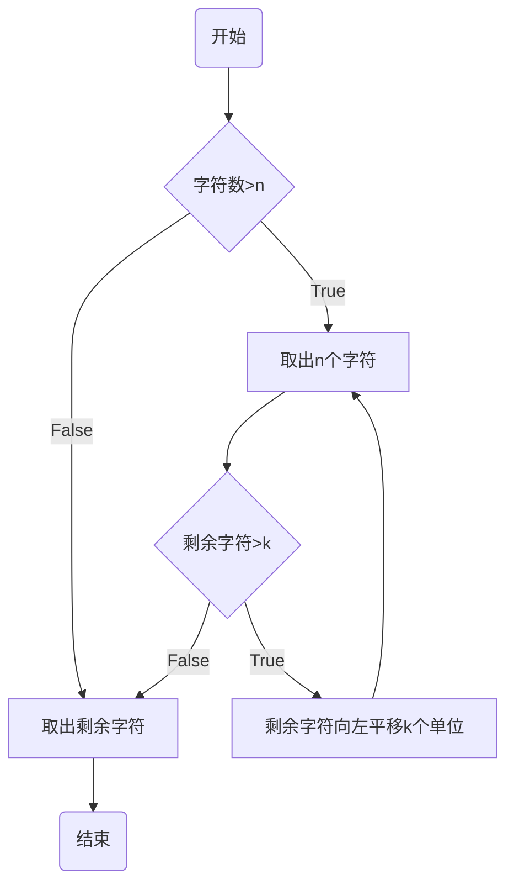

* 演示输入

|   文本   |  密钥  |   结果   |
| :------: | :----: | :------: |
| 12345678 | (2, 3) | 12675834 |

* 演示过程

|   结果   | 1 | 2 |  3  |  4  |  5  |  6  |  7  |  8  |
| -------- | - | - | :-: | :-: | :-: | :-: | :-: | :-: |
| 12       |   |   | [3] | [4] | [5] |  6  |  7  |  8  |
| 12       |   |   |  6  |  7  |  8  |  3  |  4  |  5  |
| 1267     |   |   |     |     | [8] | [3] | [4] |  5  |
| 1267     |   |   |     |     |  5  |  8  |  3  |  4  |
| 126758   |   |   |     |     |     |     |  3  |  4  |
| 12675834 |   |   |     |     |     |     |     |     |

* 演示代码

```csharp
var key = TakeTranslateCipher.Key.FromString("23");
TakeTranslateCipher.Cipher.Encrypt("12345678", key);
//> 12675834
```

----------------------------------------

### TriangleCipher

三角形排列密码

* 无密钥
* 补足长度到下一个平方数

1. 文字按行排列成(等腰直角)三角形
2. 按列读出文字

* 演示输入

|    文本   |    结果   |
| :-------: | :-------: |
| 123456789 | 526137489 |

* 演示图示

|   |   | 1 |   |   |
| - | - | - | - | - |
|   | 2 | 3 | 4 |   |
| 5 | 6 | 7 | 8 | 9 |

* 演示代码

```csharp
TriangleCipher.Cipher.Encrypt("123456789");
//> 526137489
```

----------------------------------------

### JosephusCipher

约瑟夫环[^1]密码

* 密钥$m$
* 密钥不可逆
* 加密过程

1. 想象所有人围成一个环，开始报数
2. 当报到第$m$个人，那个人就出列
3. 接着以下一人为起点开始重新报数
4. 重复步骤2和3，直到所有人都出列

* 演示输入

|  文本  | 密钥 |  结果  |
| :----: | :--: | :----: |
| 123456 |   3  | 364251 |

* 演示过程

|  结果  |  1  |  2  |  3  |  4  |  5  |  6  |
| ------ | :-: | :-: | :-: | :-: | :-: | :-: |
| 3      |  1  |  2  | [1] |  4  |  5  |  6  |
| 36     |  1  |  2  | [1] |  4  |  5  | [2] |
| 364    |  1  |  2  | [1] | [3] |  5  | [2] |
| 3642   |  1  | [4] | [1] | [3] |  5  | [2] |
| 36425  |  1  | [4] | [1] | [3] | [5] | [2] |
| 364251 | [6] | [4] | [1] | [3] | [5] | [2] |

* 演示代码

```csharp
var key = JosephusCipher.Key.FromString("3");
JosephusCipher.Cipher.Encrypt("123456", key);
//> 364251
```

[^1]: [wikipedia/Josephus_problem](https://en.wikipedia.org/wiki/Josephus_problem)

----------------------------------------

### RailFenceCipher

栅栏密码

> 严格来说，这不是真正的栅栏密码，它的名字应该是镰刀密码(ScytaleCipher[^25])，[原始栅栏密码](#OriginalRailFenceCipher)才是真正的栅栏密码，但这个错误的流传程度十分广泛，对此不必强求。

* 密钥(每组字数$n$)
* 加密过程

1. 将文字按行排列成$n$列
2. 按列依次读出文字
 
* 演示输入

|         文本        | 密钥 |         结果        |
| :-----------------: | :--: | :-----------------: |
| RailFenceCipherTest |   3  | RlnChTtaFcieeieeprs |

* 演示图示

|  R  |  a  |  i  |
| :-: | :-: | :-: |
|  l  |  F  |  e  |
|  n  |  c  |  e  |
|  C  |  i  |  p  |
|  h  |  e  |  r  |
|  T  |  e  |  s  |
|  t  |     |     |

* 演示代码

```csharp
var key = RailFenceCipher.Key.FromString("3");
RailFenceCipher.Cipher.Encrypt("RailFenceCipherTest", key);
//> RlnChTtaFcieeieeprs
```

[^25]:[wikipedia/Transposition_cipher#Scytale](https://en.wikipedia.org/wiki/Transposition_cipher#Scytale)

----------------------------------------

### OriginalRailFenceCipher[^2]

原始栅栏密码

* 密钥(栅栏/轨道数$m$)
* 加密过程

1. 明文沿对角线向下写在假想围栏的连续“轨道”上
2. 到达底部时向上移动
3. 到达顶部时再次向下移动
4. 重复步骤3和4直到写完所有字符
5. 按行读出文本

* 演示输入

|       文本      | 密钥 |      结果       |
| :-------------: | :--: | :-------------: |
| WEAREDISCOVERED |   6  | WVEOEACRRSEEIDD |

* 演示图示

| W |   |   |   |   |   |   |   |   |   | V |   |   |   |   |
| - | - | - | - | - | - | - | - | - | - | - | - | - | - | - |
|   | E |   |   |   |   |   |   |   | O |   | E |   |   |   |
|   |   | A |   |   |   |   |   | C |   |   |   | R |   |   |
|   |   |   | R |   |   |   | S |   |   |   |   |   | E |   |
|   |   |   |   | E |   | I |   |   |   |   |   |   |   | D |
|   |   |   |   |   | D |   |   |   |   |   |   |   |   |   |

* 演示代码

```csharp
//使用和普遍版本相同的密钥类型
var key = RailFenceCipher.Key.FromString("6");
OriginalRailFenceCipher.Cipher.Encrypt("WEAREDISCOVERED", key);
//> WVEOEACRRSEEIDD
```

[^2]:[wikipedia/Rail_fence_cipher](https://en.wikipedia.org/wiki/Rail_fence_cipher)

----------------------------------------

## Transposition2D

这一类型的密码为二维置换密码，仅改变内容字符的排列顺序，不改变内容，排列顺序的决定方式是一个基于二维坐标的公式$f(L,x,y)$，其中$L$为文本长度，$x$为从0开始的横坐标索引，$y$为从0开始的纵坐标索引。

你也可以指定`TranspositionCipher2D<T>.ByColumn`属性来控制文本的组合方向

这一类型的密码包括以下几个

* [周期/列置换密码](#CycleTranspose)
* [扩展栅栏密码](#AdvancedRailFenceCipher)
* [旋转栅格密码](#RotatingGrillesCipher)
* [幻方顺序密码](#MagicSquareCipher)
* [希尔伯特曲线密码](#HilbertCurveCipher)
* [螺旋曲线密码](#SpiralCurveCipher)
* [猫映射变换密码](#ArnoldCatMapCipher)
* [面包师映射变换密码](#VBakersMapCipher)
* [锯齿分割密码](#JigsawCipher)
* [数字华容道密码](#FifteenPuzzle)
* [移动数字华容道密码](#SixteenPuzzle)
* [旋转阵列密码](#TwiddlePuzzle)

----------------------------------------

### CycleTranspose

周期置换密码

* 密钥(多组排列对)
* 补足长度到宽度为排列对中最大值的矩形

1. 将文字排列成一个矩形
2. 宽度为排列对中最大值
3. 根据排列对交换文字的列
4. 依据排列数的顺序依次读出文字

* 演示输入

|      文本      |     密钥     |       结果       |
| :------------: | :----------: | :--------------: |
| Sitdownplease! | (1,2,4)(3,5) | dSoitlwenp!a\`se |

* 演示图示和过程

1. 文字排列成5列

| S | i | t | d |  o  |
| - | - | - | - | :-: |
| w | n | p | l |  e  |
| a | s | e | ! |  \` |

2. 第1列移动至第2列，第2列移动至第4列，第4列移动至第1列

| d | S | t | i |  o  |
| - | - | - | - | :-: |
| l | w | p | n |  e  |
| ! | a | e | s |  \` |

3. 第3列移动至第5列，第5列移动至第3列

| d | S |  o  | i | t |
| - | - | :-: | - | - |
| l | w |  e  | n | p |
| ! | a |  \` | s | e |

* 演示代码

```csharp
var key = CycleTranspose.Key.FromString("(1,2,4)(3,5)");
CycleTranspose.Cipher.Encrypt("Sitdownplease!", key);
//> dSoitlwenp!a`se
```

----------------------------------------

### AdvancedRailFenceCipher

扩展栅栏密码

> 有种说法的确把它称作扩展栅栏密码，但它应该叫做列置换(ColumnarTransposition[^26])

* 密钥(一组合法的排列)
* 补足长度到宽度为排列长度的矩形

1. 将文字按行排列成一个矩形
2. 矩形宽度为排列长度
3. 依据排列数的顺序按列读出文字

* 演示输入

|        文本       |      密钥     |            结果           |
| :---------------: | :-----------: | :-----------------------: |
| eg1ML9mymEqtKzeN0 | 7,4,3,5,6,2,1 | mz\`9K\`1E0gmNMq\`Lt\`eye |

* 演示图示和过程

1. 文字排列成7列

| [7] | [4] | [3] | [5] | [6] | [2] | [1] |
| :-: | :-: | :-: | :-: | :-: | :-: | :-: |
|  e  |  g  |  1  |  M  |  L  |  9  |  m  |
|  y  |  m  |  E  |  q  |  t  |  K  |  z  |
|  e  |  N  |  0  |  \` |  \` |  \` |  \` |

2. 将列表按照7,4,3,5,6,2,1列的顺序填入

| [1] | [2] | [3] | [4] | [5] | [6] | [7] |
| :-: | :-: | :-: | :-: | :-: | :-: | :-: |
|  m  |  9  |  1  |  g  |  M  |  L  |  e  |
|  z  |  K  |  E  |  m  |  q  |  t  |  y  |
|  \` |  \` |  0  |  N  |  \` |  \` |  e  |

* 演示代码

```csharp
var key = AdvancedRailFenceCipher.Key.FromString("7,4,3,5,6,2,1");
AdvancedRailFenceCipher.Cipher.Encrypt("eg1ML9mymEqtKzeN0", key);
//> mz`9K`1E0gmNMq`Lt`eye
```

* 也可以通过单词创建排列(按字符编码顺序)

```csharp
var permut = PermutHelper.WordToPermutation("KEYWORD");
//> 3,2,7,6,4,5,1
var key = AdvancedRailFenceCipher.Key.FromString(permut);
AdvancedRailFenceCipher.Cipher.Encrypt("eg1ML9mymEqtKzeN0", key);
//> mz`gmNeyeLt`9K`Mq`1E0
```

[^26]:[wikipedia/Transposition_cipher#Columnar_transposition](https://en.wikipedia.org/wiki/Transposition_cipher#Columnar_transposition)

----------------------------------------

### RotatingGrillesCipher

旋转栅格密码

* 密钥\(栅格位置\)
* 补充字符\(默认\`\)

1. 准备一个$4n^2$的矩形
2. 在指定的位置挖出洞
3. 在栅格对应的位置填入文字
4. 旋转栅格(默认顺时针旋转)
5. 重复步骤填入4次
6. 按行读出结果

* 如下所示即是一个栅格(H代表对应位置有洞)
* 该栅格由`QuaterArray`类型表示，字符串形式为`4:tA==`

|   |   | H |   |
| - | - | - | - |
|   | H |   |   |
| H |   |   |   |
|   |   |   | H |

* 演示输入

|       文本       |   密钥   |       结果       |
| :--------------: | :------: | :--------------: |
| meetmeattwelvepm | `4:tA==` | tmmveeewepeatlmt |

* 演示图示和过程

1. 将meet填入栅格位置，并旋转栅格

|     |  -  |  m  |     |
| :-: | :-: | :-: | :-: |
|     |  e  |  -  |     |
|  e  |     |     |  -  |
|  -  |     |     |  t  |

2. 填入meat并旋转栅格

|  -  |  m  |  m  |     |
| :-: | :-: | :-: | :-: |
|     |  e  |  e  |  -  |
|  e  |     |  -  |  a  |
|  t  |  -  |     |  t  |

3. 填入twel并旋转栅格

|  t  |  m  |  m  |  -  |
| :-: | :-: | :-: | :-: |
|  -  |  e  |  e  |  w  |
|  e  |  -  |  e  |  a  |
|  t  |  l  |  -  |  t  |

4. 填入vepm并旋转栅格

|  t  |  m  |  m  |  v  |
| :-: | :-: | :-: | :-: |
|  e  |  e  |  e  |  w  |
|  e  |  p  |  e  |  a  |
|  t  |  l  |  m  |  t  |

* 演示代码

```csharp
var cipher = new RotatingGrillesCipher();
var qArr = new QuaterArray(4);
qArr[0] = 2;
qArr[1] = 3;
qArr[2] = 1;
qArr[3] = 0;
var key = new RotatingGrillesCipher.Key(qArr);
//var key = RotatingGrillesCipher.Key.FromString("4:tA==");
cipher.Encrypt("meetmeattwelvepm", key);//tmmveeewepeatlmt
```

* 也可以设置 `cipher.AntiClockwise`属性来让栅格逆时针旋转

----------------------------------------

### MagicSquareCipher

幻方顺序密码

* 无密钥
* 补充字符\(默认\`\)

1. 用特定的方法构造n阶幻方\(幻方可以有很多种顺序，但这里只采用以下方法产生的顺序\)
   - 奇数阶幻方使用Louberel(Siamese)法[^3]
   - 双偶阶幻方使用对称交换法[^4]
   - 单偶阶幻方使用Strachey法[^5]

2. 根据幻方的顺序，按行读出文字

* 3阶幻方的图示

| 8 | 1 | 6 |
| - | - | - |
| 3 | 5 | 7 |
| 4 | 9 | 2 |

* 演示代码

```csharp
var cipher = new MagicSquareCipher();
cipher.Encrypt("123456789");//816357492
```

[^3]:[wikipedia/Siamese_method](https://en.wikipedia.org/wiki/Siamese_method)

[^4]:[wikipedia/Magic_square#doubly_even_order](https://en.wikipedia.org/wiki/Magic_square#A_method_of_constructing_a_magic_square_of_doubly_even_order)

[^5]:[wikipedia/Strachey_method](https://en.wikipedia.org/wiki/Strachey_method_for_magic_squares)

----------------------------------------

### HilbertCurveCipher

希尔伯特曲线密码

* 无密钥
* 补充字符\(默认\`\)

1. 从左上角开始到左下角的路径构造希尔伯特曲线
2. 根据路径顺序依次填入字符
3. 按行读出文字

* 前4阶的希尔伯特曲线如图所示

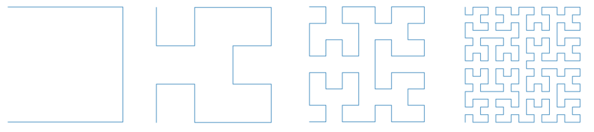

* 2阶的曲线顺序图示

|  1  |  4  |  5  |  6  |
| :-: | :-: | :-: | :-: |
|  2  |  3  |  8  |  7  |
| 15  | 14  |  9  | 10  |
| 16  | 13  | 12  | 11  |

* 演示代码

```csharp
var cipher = new HilbertCurveCipher();
cipher.Encrypt("0123456789ABCDEF");//03451276ED89FCBA
```

----------------------------------------

### SpiralCurveCipher

螺旋曲线密码

* 密钥\(列数\)
* 补充字符\(默认\`\)

1. 从左上到右上顺序
2. 从右上到右下顺序
3. 从右下到左下顺序
4. 从左下到左上顺序
5. 不重复无遗漏地螺旋顺序排列文本

* 4x4时的顺序图示

|  1  |  2  |  3  |  4  |
| :-: | :-: | :-: | :-: |
| 12  | 13  | 14  |  5  |
| 11  | 16  | 15  |  6  |
| 10  |  9  |  8  |  7  |

* 演示代码

```csharp
var cipher = new HilbertCurveCipher();
cipher.Encrypt("0123456789ABCDEF");//0123BCD4AFE59876
```

----------------------------------------

### ArnoldCatMapCipher

猫映射变换[^6]密码

* 无密钥
* 补充字符\(默认\`\)

1. 文字排列成$n^2$的方阵
2. $x=(2x+y)\mod n$
3. $y=(x+y)\mod n$
4. 根据变换后的顺序加密文本

* 演示图示
  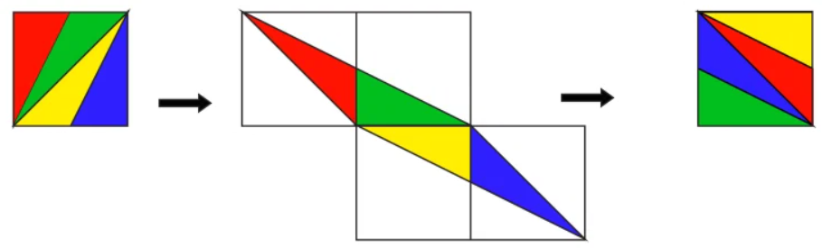
* 演示过程

| 0 | 1 | 2 | 3 |
| - | - | - | - |
| 4 | 5 | 6 | 7 |
| 8 | 9 | A | B |
| C | D | E | F |

* 变换后

| 0 |   |   |   |   |   |   |   |   |   |
| - | - | - | - | - | - | - | - | - | - |
|   | 4 | 1 |   |   |   |   |   |   |   |
|   |   | 8 | 5 | 2 |   |   |   |   |   |
|   |   |   | C | 9 | 6 | 3 |   |   |   |
|   |   |   |   |   | D | A | 7 |   |   |
|   |   |   |   |   |   |   | E | B |   |
|   |   |   |   |   |   |   |   |   | F |

* 结果

| 0 | D | A | 7 |
| - | - | - | - |
| B | 4 | 1 | E |
| 2 | F | 8 | 5 |
| 9 | 6 | 3 | C |

* 演示代码

```csharp
var cipher = new ArnoldCatMapCipher();
cipher.Encrypt("0123456789ABCDEF");//0DA7B41E2F85963C
```

[^6]:[wikipedia/Arnold's_cat_map](https://en.wikipedia.org/wiki/Arnold%27s_cat_map)

----------------------------------------

### VBakersMapCipher

面包师映射变换[^7]密码

* 无密钥
* 补充字符\(默认\`\)
* 原始版本的变换公式存在一定程度上的不便，所以实际采用修改的版本，具体以下面的演示过程为准

* 偶数阶的方阵

| 0 | 1 | 2 | 3 |
| - | - | - | - |
| 4 | 5 | 6 | 7 |
| 8 | 9 | A | B |
| C | D | E | F |

* 折叠前的样子

| 0 | 4 | 1 | 5 | 2 | 6 | 3 | 7 |
| - | - | - | - | - | - | - | - |
| 8 | C | 9 | D | A | E | B | F |

* 折叠后的结果

| 0 | 4 | 1 | 5 |
| - | - | - | - |
| 8 | C | 9 | D |
| 2 | 6 | 3 | 7 |
| A | E | B | F |

* 奇数阶的方阵

| A | B | C | D | E |
| - | - | - | - | - |
| F | G | H | I | J |
| K | L | M | N | O |
| P | Q | R | S | T |
| U | W | X | Y | Z |

* 折叠前的样子

| A | F | B | G | C | H | D | I | E | J |
| - | - | - | - | - | - | - | - | - | - |
| K | P | L | Q | M | R | N | S | O | T |
| U | W | X | Y | Z |   |   |   |   |   |

* 折叠后的结果

| A | F | B | G | C |
| - | - | - | - | - |
| K | P | L | Q | M |
| U | W | X | Y | Z |
| H | D | I | E | J |
| R | N | S | O | T |

[^7]:[wikipedia/Baker's_map](https://en.wikipedia.org/wiki/Baker%27s_map)

----------------------------------------

### JigsawCipher

锯齿分割密码

* 密钥\(文本方阵边长的一个整数分拆\)
* 补充字符\(默认`\)
1. 文字排列成$n^2$的方阵
2. 取整数$n$的一个分拆${p_1,p_2,...,p_n}$
3. 方阵竖着划分成$n$个块
4. 每一个块按顺序分割成$p_i$个面积为$n$的锯齿拼图
5. 余项使用右对齐
6. 根据**特定的顺序**写入文字
* 下图为使用`1,5,2,3`加密文本的图示
* 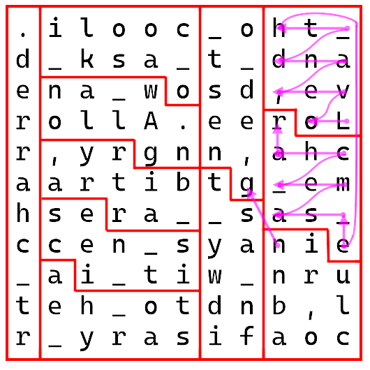

----------------------------------------

### FifteenPuzzle

数字华容道[^8]密码

* 数字华容道密码
* 密钥\(移动步骤\)
* 补充字符\(默认`\)
1. 文字排列成$n^2$的方阵
2. 右下角的位置空着
3. 移动空位和相邻的内容交换
4. 经过一系列移动后再读出方阵
* 密钥由`QuaterArray`类型表示

* 演示输入

|       文本       |     密钥    |       结果       |
| :--------------: | :---------: | :--------------: |
| 0123456789ABCDEF | `1,2,2,3,0` | 012345678D9ACE_B |

* 演示过程
* 步骤为`1,2,2,3,0`\(↑←←↓→\)

| 0 | 1 | 2 | 3 |
| - | - | - | - |
| 4 | 5 | 6 | 7 |
| 8 | 9 | A | B |
| C | D | E | _ |

| 0 | 1 | 2 | 3 |
| - | - | - | - |
| 4 | 5 | 6 | 7 |
| 8 | 9 | A | _ |
| C | D | E | B |

| 0 | 1 | 2 | 3 |
| - | - | - | - |
| 4 | 5 | 6 | 7 |
| 8 | 9 | _ | A |
| C | D | E | B |

| 0 | 1 | 2 | 3 |
| - | - | - | - |
| 4 | 5 | 6 | 7 |
| 8 | _ | 9 | A |
| C | D | E | B |

| 0 | 1 | 2 | 3 |
| - | - | - | - |
| 4 | 5 | 6 | 7 |
| 8 | D | 9 | A |
| C | _ | E | B |

| 0 | 1 | 2 | 3 |
| - | - | - | - |
| 4 | 5 | 6 | 7 |
| 8 | D | 9 | A |
| C | E | _ | B |

* 演示代码

```csharp
var qArr = new QuaterArray(5);
qArr[0] = 1;
qArr[1] = 2;
qArr[2] = 2;
qArr[3] = 3;
qArr[4] = 0;

var cipher = new FifteenPuzzle();
var key = new FifteenPuzzle.Key(qArr);
cipher.Encrypt("0123456789ABCDE_", key);//012345678D9ACE_B
```

[^8]:[wikipedia/15_puzzle](https://en.wikipedia.org/wiki/15_puzzle)

----------------------------------------

### SixteenPuzzle

移动数字华容道密码

* 密钥\(移动步骤\)
* 补充字符\(默认\`\)
1. 文字排列成$n^2$的方阵
2. 首尾循环地移动整行/列
3. 经过一系列移动后再读出方阵
* 密钥由正数和负数分别代表行列，移动方向为右和下

* 演示输入

|       文本       |      密钥     |       结果       |
| :--------------: | :-----------: | :--------------: |
| 0123456789ABCDEF | `2,-3,1,4,-1` | F01E3426795B8CDA |

* 演示过程
* 初始局面为

| 0 | 1 | 2 | 3 |
| - | - | - | - |
| 4 | 5 | 6 | 7 |
| 8 | 9 | A | B |
| C | D | E | F |

| 0 | 1 | 2 | 3 |
| - | - | - | - |
| 7 | 4 | 5 | 6 |
| 8 | 9 | A | B |
| C | D | E | F |

| 0 | 1 | E | 3 |
| - | - | - | - |
| 7 | 4 | 2 | 6 |
| 8 | 9 | 5 | B |
| C | D | A | F |

| 3 | 0 | 1 | E |
| - | - | - | - |
| 7 | 4 | 2 | 6 |
| 8 | 9 | 5 | B |
| F | C | D | A |

| F | 0 | 1 | E |
| - | - | - | - |
| 3 | 4 | 2 | 6 |
| 7 | 9 | 5 | B |
| 8 | C | D | A |

* 演示代码

```csharp
var cipher = new SixteenPuzzle();
var key = SixteenPuzzle.Key.FromString("2,-3,1,4,-1");
cipher.Encrypt("0123456789ABCDEF", key);//F01E3426795B8CDA
```

----------------------------------------

### TwiddlePuzzle

旋转阵列密码

* 密钥\(有序的旋转位置\)
* 补充字符\(默认\`\)
1. 文字排列成$n^2$的方阵
2. 以指定的4个格子为中心顺时针旋转
3. 经过一系列旋转后再读出方阵
* 密钥由数字代表第几个旋转的位置

* 演示输入

|       文本       |    密钥   |       结果       |
| :--------------: | :-------: | :--------------: |
| 0123456789ABCDEF | `1,2,3,5` | 412059638A7BCDEF |

* 演示过程
* 初始局面为

| 0 | 1 | 2 | 3 |
| - | - | - | - |
| 4 | 5 | 6 | 7 |
| 8 | 9 | A | B |
| C | D | E | F |

| 4 | 0 | 2 | 3 |
| - | - | - | - |
| 5 | 1 | 6 | 7 |
| 8 | 9 | A | B |
| C | D | E | F |

| 4 | 1 | 0 | 3 |
| - | - | - | - |
| 5 | 6 | 2 | 7 |
| 8 | 9 | A | B |
| C | D | E | F |

| 4 | 1 | 2 | 0 |
| - | - | - | - |
| 5 | 6 | 7 | 3 |
| 8 | 9 | A | B |
| C | D | E | F |

| 4 | 1 | 2 | 0 |
| - | - | - | - |
| 5 | 9 | 6 | 3 |
| 8 | A | 7 | B |
| C | D | E | F |

* 演示代码

```csharp
var cipher = new TwiddlePuzzle();
var key = TwiddlePuzzle.Key.FromString("1,2,3,5");
cipher.Encrypt("0123456789ABCDEF", key);//412059638A7BCDEF
```

----------------------------------------

## Replacement

这一类型的密码是通过将明文的符号替换成其他符号来实现加密的过程。

这一类型的密码包括以下几个

* [单表替换密码](#SingleReplacementCipher)
* [摩斯密码](#MorseCode)
* [中文电码](#CommercialCode)
* [Enigma加密机](#EnigmaMachine)
* [编码转换](#Encoder)
* [编程语言](#PLEncoding)

----------------------------------------

### SingleReplacementCipher

单表替换密码，这类密码将明文的字符对应为另一组字符，包括以下几个

1. 仿射密码
2. 凯撒密码
3. QWER键盘表
4. Atbash
5. 汉语拼音
6. rot5
7. rot13
8. rot18(rot5+rot13)
9. rot47
10. Al Bhed(包括日语的部分)
11. Dvorak
12. DvorakLeftHand
13. DvorakRightHand
14. Colemak
15. LIIGOLLayout
16. AZERTY
17. Asset
18. Carpalx
19. Minimak4Keys
20. Minimak8Keys
21. Minimak12Keys
22. Norman
23. Workman
24. MTOHOEM
25. Saurian
26. PartTimerDevil
27. IChingEightTrigramsBase64
28. 火星文
29. 敲击码
30. 更多可自定义

----------------------------------------

### MorseCode

* 纯英文字母摩斯密码
* 扩展数字和符号的摩斯密码
* 数字短码

----------------------------------------

### CommercialCode

* 标准中文电码(Chinese Commercial Code)[^9]
* 使用数字短码进行编码

[^9]:[Chinese Commercial Code](https://www.chasedream.com/show.aspx?id=4487&cid=30)

----------------------------------------

### EnigmaMachine

二战德国使用的Enigma加密机

* *此功能正在开发中*

----------------------------------------

## Encoder

计算机编码之间的转换，支持以下几种

* Base100[^10]
* Base2048[^11]
* Base65536[^12]
* Base32768[^13]
* Base32[^14]
* Base85[^15]
* Base(使用任意的表来编码)
* 2,4,8,16进制
* 盲文编码[^16]
* 罗马数字转换
* 拼音9键
* BubbleBabble[^17]
* 国家通用盲文方案[^18]
* 四角号码[^19]
* QuotedPrintable[^20]
* Unicode字符串
* UrlEncode
* HtmlEncode

[^10]:[base100](https://github.com/AdamNiederer/base100)
[^11]:[base2048](https://github.com/qntm/base2048)
[^12]:[base65536](https://github.com/qntm/base65536)
[^13]:[base32768](https://github.com/qntm/base32768)
[^14]:[wikipedia/Base32](https://en.wikipedia.org/wiki/Base32)
[^15]:[wikipedia/Base85](https://en.wikipedia.org/wiki/Ascii85)
[^16]:[braille-encode](https://github.com/qntm/braille-encode)
[^17]:[Bubble_Babble](http://bohwaz.net/archives/web/Bubble_Babble.html)
[^18]:[国家通用盲文方案](http://www.moe.gov.cn/jyb_sjzl/ziliao/A19/201807/W020180725666187054299.pdf)
[^19]:[wikipedia/四角号码](https://zh.wikipedia.org/zh-cn/%E5%9B%9B%E8%A7%92%E5%8F%B7%E7%A0%81)
[^20]:[wikipedia/Quoted-printable](https://en.wikipedia.org/wiki/Quoted-printable)

----------------------------------------

### PLEncoding

与编程语言强烈相关的，支持以下几种

* Python中的bytes字符串
* Punycode[^21]
* PPEncode[^22]
* AAEncode
* JJEncode
* Jother
* Brainfuck[^23]

[^21]:[wikipedia/Punycode](https://en.wikipedia.org/wiki/Punycode)
[^22]:[esolangs/Ppencode](https://esolangs.org/wiki/Ppencode)
[^23]:[wikipedia/Brainfuck](https://en.wikipedia.org/wiki/Brainfuck)

----------------------------------------

## Calculation

使用特殊的自定义算法计算的密码，实现了以下几种

* [ShortHide5](#ShortHide5)
* [RSA隐写术](#RSASteganograph)
* [完美洗牌密码](#PerfectShuffle)

----------------------------------------

### ShortHide5

* 无密钥
* [Standard Short Hide5(标准SH5)](https://www.bilibili.com/read/cv15660906)
* [标准的1组SH5推荐字母表](https://www.bilibili.com/read/cv15676311)

----------------------------------------

### RSASteganograph

RSA隐写术

* 以指定的前缀字节生成质数并计算RSA私钥
* 生成的私钥可以像正常的私钥一样使用
* 可指定生成xml或pem格式的密钥
* 演示代码

```csharp
var text = "天空不会一直都晴朗的，偶尔会下些雨滴，也有吹起暴风雨的时候，景色会渐渐的改变。";
var pemkey = RSASteganograph.GenerateRSAPrivateKey(text, true);
//将会生成一个pem格式的RSA私钥
RSASteganograph.GetTextFrom(pemkey);//获取其中的文本
```

----------------------------------------

### PerfectShuffle

完美洗牌密码

* 对于字母表进行2种交替式的完美洗牌
* 取指定的首字母作为结果

----------------------------------------

## Image

加密结果为图像的密码，包含以下几种

* [猪圈密码](#PigpenCipher)
* [彩色二维码](#ColorfulBarcode)
* [摩尔纹](#MoirePattern)
* [编织图形密码](#WeaveCipher)
* [僧侣密码数字](#CisterciansNumerals)
* [图片隐写术](#Steganography)
* [图片加密工具](#NotMosaic)
* [幻影坦克](#PhantomTank)

### PigpenCipher

猪圈密码

* 无密钥
* 仅处理纯英文字母文本
* 标准版本字母表

* 变体版本字母表


----------------------------------------

### ColorfulBarcode

彩色二维码

* 无密钥
1. 文字分成3部分/6部分
2. 生成3个/6个二维码
3. 二维码分别对应rgb色彩通道(3份)
4. 6组色彩请参考具体实现

* 一个3色二维码的例子

* 内容为`3oX+o67864CwiRYVndetxFyZuy7T59Rv0gc9eUSKwU/kWbNy1PGbtfJrrE/s9Can0N5sbPyOcXedYvwEom6qmQqMlfLCwkpZrp3j`


* 相同的内容的6色二维码为

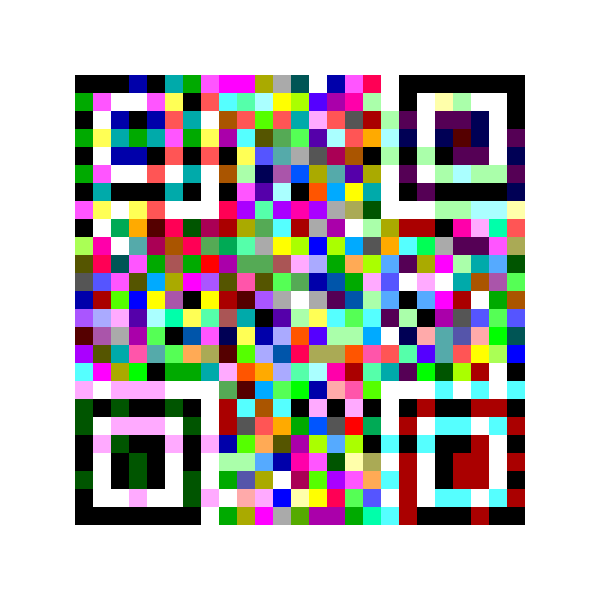

```csharp
var plainText = "你想编码的内容";
var bitmap = ColorfulBarcode.Encode(plainText);//生成3色二维码
var text = ColorfulBarcode.Recognize(bitmap);//识别3色二维码
bitmap = ColorfulBarcode.EncodeSixColor(plainText);//生成6色二维码
text = ColorfulBarcode.RecognizeSixColor(bitmap);//识别6色二维码
```

----------------------------------------

### MoirePattern

摩尔纹

* 支持非嵌入式和嵌入式
* 支持自定义条纹样式
* 支持静态内容和多帧内容
* 静态非嵌入式的例子

```csharp
MoirePattern.Font = new Font("微软雅黑", 36);
var bitmap = MoirePattern.DrawText("这是摩尔纹", 300, 80, MoirePatternTypes.DiagonalPatten);
bitmap.Save("E:/MoirePattern.png");
```

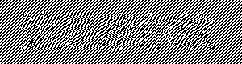

```csharp
MoirePattern.FillPatten(bitmap, MoirePatternTypes.DiagonalPatten);
```

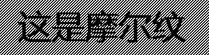

```csharp
MoirePattern.FillPatten(bitmap, MoirePatternTypes.DiagonalPatten, removePatten: true);//指定去除条纹
```

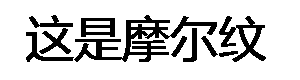

* 嵌入式的例子，更换了波形的条纹

```csharp
MoirePattern.Font = new Font("微软雅黑", 36);
var bitmap = MoirePattern.DrawText("这是摩尔纹", 300, 80, MoirePatternTypes.SinWavePatten, true);
bitmap.Save("E:/MoirePatternEmbedded.png");
```

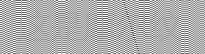

* 考虑到嵌入式的呈现效果，只选择条纹去除的效果

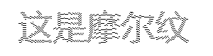

* 多帧的摩尔纹示例

```csharp
MoirePattern.Font = new Font("微软雅黑", 36);
var bitmap = MoirePattern.DrawTexts(new[] { "这", "是", "摩", "尔", "纹" }, 80, 80);
bitmap.Save("E:/Pattens.png");
MoirePattern.FillAndSavePattens(bitmap, 5, "E:/Pattens");
```

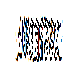
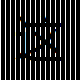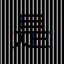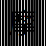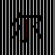

----------------------------------------

### WeaveCipher

编织图形密码

* [参考实现逻辑](https://tieba.baidu.com/p/7814788182)
* 扩展的(带有三角形的)图形的实现有所变化

* 正方形的例子

```csharp
var bitmap = WeaveCipher.Encrypt("GOOD");
bitmap.Save("E:/WeaveCipher.png");
WeaveCipher.Decrypt(bitmap);//GOOD
```

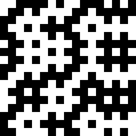

* 带有三角形的例子

```csharp
var bitmap = WeaveCipher.EncryptExtend("GOOD Night");
bitmap.Save("E:/WeaveCipherExtend.png");
```

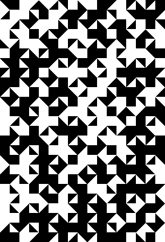

----------------------------------------

### CisterciansNumerals[^24]

僧侣密码数字，用特定符号表示的10000进制数字系统

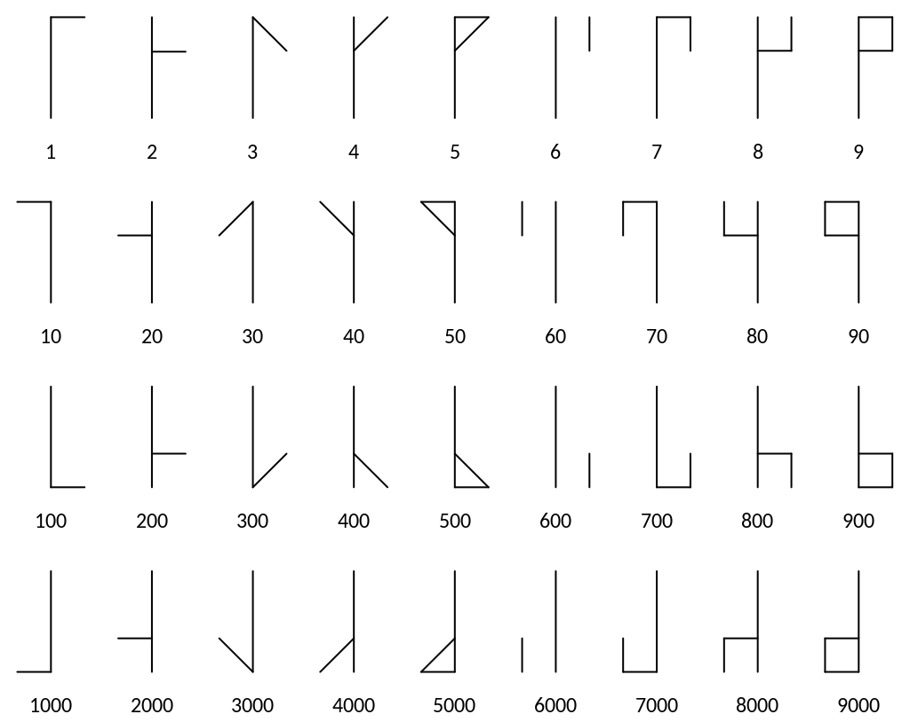

* 演示代码

```csharp
var bitmap = CisterciansNumerals.Encode(12345678);
bitmap.Save("E:/12345678.png");
```

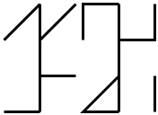

[^24]:[wikipedia/Cistercian_numerals](https://en.wikipedia.org/wiki/Cistercian_numerals)

----------------------------------------

### Steganography

图片隐写术，在图片像素颜色数值的LSB(最低有效位)写入信息

* 独立程序(不在此库中)
* Winforms程序(net6.0-windows)
* [存储库地址](https://github.com/Lazuplis-Mei/Steganography)

### NotMosaic

对图片的指定区域进行加密

* 对指定的矩形区域进行加密
* 支持使用密码加密
* 使用掩码调整效果

* 演示图片


* 演示代码

```csharp
var bitmap = new Bitmap("E:/NotMosaicSample.png");
var rects = new Rectangle[]
{
    new Rectangle(100, 50, 100, 200),
};
bitmap = NotMosaic.Encrypt(bitmap, rects, out EncryptRegions encryptRegions, "123456");
bitmap.Save("E:/NotMosaicEncrypted.png");
```

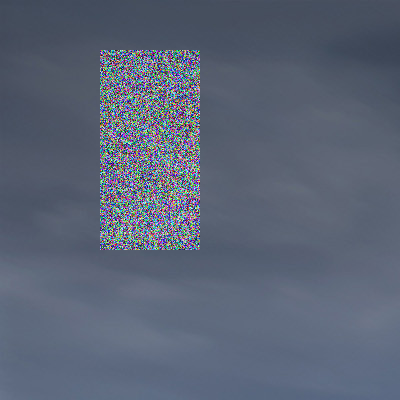

```csharp
NotMosaic.Decrypt(bitmap, encryptRegions, "123456").Save("E:/NotMosaicDecrypted.png");
```


----------------------------------------

### PhantomTank

幻影坦克，利用调色和混合让图片在黑白两色的背景下显示不同的内容。

* 支持彩色图片

* 演示图片


* 演示代码

```csharp
PhantomTank.Combine(new Bitmap("E:/Foreground.png"), new Bitmap("E:/Background.png")).Save("E:/PhantomTank.png");
```


* 彩色图片演示

```csharp
PhantomTank.CombineColorful(new Bitmap("E:/Foreground.png"), new Bitmap("E:/Background.png")).Save("E:/ColorfulPhantomTank.png");
```


----------------------------------------

## Sound

加密结果为声音的密码

### MorseMoonlight

摩斯月光奏鸣曲

* 将摩斯密码掺入月光奏鸣曲第一乐章的节奏中

```csharp
var morseCode = MorseCode.Standred.ToMorse("MorseMoonlight");
MorseMoonlight.ExportMidi(morseCode, "E:/MorseMoonlight.mid");
MorseMoonlight.ExportWav(morseCode, "E:/MorseMoonlight.wav");
//如果你希望能够编码为Wav，你需要提供soundfont文件，在TIMIDITY.CFG中编辑
```

[MorseMoonlight.mid](https://github.com/Lazuplis-Mei/ClassicalCryptography/blob/main/Sound/MorseMoonlight.mid)

* 注意：可编码的节奏长度有限

----------------------------------------

## Undefined

未做具体归类的密码

### SemaphorePathCipher

* 旗语路径密码
* 无密钥
* 

  1. 从左往右进入左上角开始
  2. 根据旗语对应的符号连接写一个字母
  3. 删除所有路径上的字母
  4. 剩余的则为内容

----------------------------------------

### StringArtCipher

* 弦艺术密码
* 使用22个针脚的欧拉字体
* 使用22个针脚的非欧拉字体

----------------------------------------

### PascalianPuzzleCipher

* 帕斯卡谜题密码
* *(暂时性的提示)试着挑战它吧*