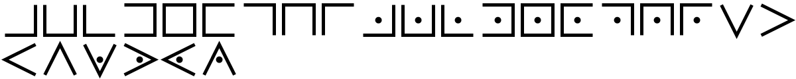
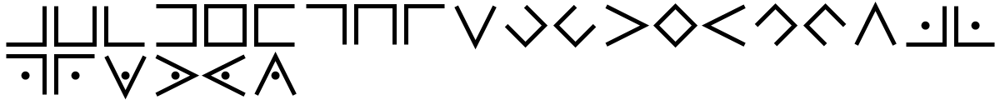
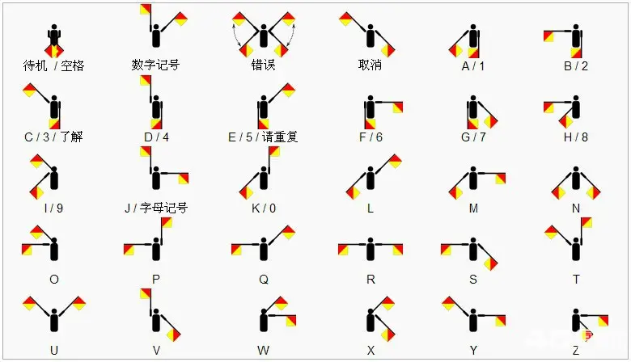

# ClassicalCryptography

古典密码

## Transposition

一维置换密码，仅改变字符排列顺序，不改变内容。

---

### ReverseCipher

* 倒序密码
* 无密钥
  1. 文字从右向左读出

```text
12345678

87654321
```

---

### TakeTranslateCipher

* 取平移密码
* 有密钥 ***(N,K)***
* 密钥不可逆
  1. 先取出***N***个字符
  2. 对剩余的字符向左平移 ***K*** 个单位
  3. 回到步骤1，直到剩余字符不足 ***K***个
  4. 剩余字符(如果有)直接连接

```text
12345678
StringKey = "23"
Key = (2,3)

12 345678
12 678345
1267 8345
1267 5834
126758 34

12675834
```

---

### TriangleCipher

* 三角排列密码
* 无密钥
* 可能需要补充字符(默认`)

  1. 文字按行排列成(等腰直角)三角形
  2. 按列读出文字
* 如下所示即是一个三角形排列

  |   |   | 1 |   |   |
  | - | - | - | - | - |
  |   | 1 | 1 | 1 |   |
  | 1 | 1 | 1 | 1 | 1 |

```text
123456789

  1
 234
56789

526137489
```

---

### JosephusCipher

* 约瑟夫问题密码
* 有密钥 ***M***
* 密钥不可逆
  1. 所有人围城一个环，从第一个人开始报数
  2. 报到第***M***个人，那个人就出列
  3. 从下一个人开始报数
  4. 直到所有人都出列

```text
123456
StringKey = "3"
Key = 3

 123456
3 12456
36 1245
364 125
3642 15
36425 1
364251

364251
```

## Transposition2D

二维置换密码，仅(使用二维的矩形空间)改变字符排列顺序，不改变内容。

### CycleTranspose

* 周期置换密码
* 列置换密码
* 有密钥(多组排列对)
* 可能需要补充字符(默认`)
  1. 将文字排列成一个矩形(宽度即为排列长度)
  2. 根据排列对交换文字的列
  3. 依据排列数的顺序依次读出文字(按行按列都可以)

```text
Sitdownplease!
StringKey = "(1,2,4)(3,5)"
Key = (1,2,4)(3,5)

S i t d o
w n p l e
a s e ! `
(1,2,4)
1->2  2->4  4->1

d S t i o
l w p n e
! a e s `

(3,5)
3->5  5->3

d S o i t
l w e n p
! a ` s e

dSoitlwenp!a`se

```

---

### RailFenceCipher

* 栅栏密码
* 扩展栅栏密码
* 有密钥(每组字数或一个排列)
* 可能需要补充字符(默认`)
  1. 将文字排列成一个矩形
  2. 矩形宽度为分组数(或排列长度)
  3. (依据排列的顺序)按列依次读出文字

```text
RailFenceCipherTest
StringKey = "3"
Key = 3

R a i
l F e
n c e
C i p
h e r
T e s
t ` `

RlnChTtaFciee`ieeprs`
```

---

### RotatingGrillesCipher

* 旋转栅格密码
* 有密钥(一个正方形的栅格,用4进制数组表示挖洞的情况)
* 可能需要补充字符(默认`)

  1. 准备一个4N^2的矩形
  2. 在指定的位置挖出洞
  3. 在栅格对应的位置填入文字
  4. 旋转栅格(默认顺时针旋转)
  5. 重复步骤填入4次
  6. 按行读出结果
* 如下所示即是一个栅格(H代表对应位置有洞)

  |   |   | H |   |
  | - | :- | - | - |
  |   | H |   |   |
  | H |   |   |   |
  |   |   |   | H |

```text
meetmeattwelvepm
StringKey = "4:tA=="
此格式由QuaterArray表示的4进制数组生成(Count:Base64)
Key = QuaterArray {2,3,1,0}

左上角的1/4为一个N^2的方阵
如果栅格的洞是在这些位置里，那么数组对应值为0
如果栅格的洞在顺时针旋转后的位置里，那么值为旋转次数

这是左上角4个位置的顺序
1 2 . .
3 4 . .
. . . .
. . . .
如果右下角是栅格的洞，那么第1个位置的值为2
. . . .
. . . .
. . . .
. . . 1

QuaterArray{2,3,1,0}对应的栅格是这样(H代表洞)
. . H .
. H . .
H . . .
. . . H

在栅格写入文字 meet meattwelvepm
. . m .
. e . .
e . . .
. . . t

旋转栅格(此处栅格的位置用-表示)
. - m .
. e - .
e . . -
- . . t
写入文字 meat twelvepm
. m m .
. e e .
e . . a
t . . t

旋转栅格
- m m .
. e e -
e . - a
t - . t
写入文字 twel vepm
t m m .
. e e w
e . e a
t l . t

旋转栅格
t m m -
- e e w
e - e a
t l - t
写入文字 vepm
t m m v
e e e w
e p e a
t l m t

得到结果
tmmveeewepeatlmt
```

---

### MagicSquareCipher

* 幻方正序密码
* 无密钥
* 可能需要补充字符(默认`)

  1. 用特定的方法构造N阶幻方
  2. 根据幻方的顺序，按行读出文字
* 如下所示即是一个3阶幻方(行列和对角线的和都相等)

  | 8 | 1 | 6 |
  | - | :- | - |
  | 3 | 5 | 7 |
  | 4 | 9 | 2 |

```text
0123456789ABCDEF

对应的幻方
01 15 14 04
12 06 07 09
08 10 11 05
13 03 02 16

根据顺序按行读出
0ED3B56879A4C21F
```

---

### HilbertCurveCipher

* 希尔伯特曲线密码
* 无密钥
* 可能需要补充字符(默认`)

  1. 从左上角开始，到左下角的路径构造希尔伯特曲线
  2. 根据路径顺序，按行读出文字

```text
0123456789ABCDEF

对应的希尔伯特曲线顺序
01 04 05 06
02 03 08 07
15 14 09 10
16 13 12 11

根据顺序按行读出
03451276ED89FCBA
```

---

### SpiralCurveCipher

* 螺旋曲线密码
* 有密钥(方形宽度)
* 可能需要补充字符(默认`)

  1. 从左上==>右上顺序
  2. 从右上==>右下顺序
  3. 从右下==>左下顺序
  4. 从左下==>左上顺序
  5. 不重复无遗漏地螺旋顺序排列文本

```text
0123456789ABCDEF

对应的螺旋顺序
01 02 03 04
12 13 14 05
11 16 15 06
10 09 08 07

根据顺序按行读出
0123BCD4AFE59876
```

---

### ArnoldCatMapCipher

* 猫映射变换密码
* 无密钥
* 可能需要补充字符(默认`)

  1. 文字排列成N^2的方阵
  2. x=>2x+y(mod N)
  3. y=>x+y(mod N)
  4. 根据变换后的顺序加密文本

---

### VBakersMapCipher

* 魔改Baker's映射变换密码
* 无密钥
* 可能需要补充字符(默认`)
* 具体方法请前往[VBakersMapCipher.cs](https://github.com/Lazuplis-Mei/ClassicalCryptography/blob/main/ClassicalCryptography/Transposition2D/VBakersMapCipher.cs)查看代码

### JigsawCipher

* 锯齿分割密码
* 有密钥(文本方阵的一个整数分拆)
* 可能需要补充字符(默认`)
* 具体方法请前往[JigsawCipher.cs](https://github.com/Lazuplis-Mei/ClassicalCryptography/blob/main/ClassicalCryptography/Transposition2D/JigsawCipher.cs)查看代码

  1. 文字排列成N^2的方阵
  2. 取整数N的一个分拆{P1,P2,...,Pn}
  3. 方阵竖着划分成n个块
  4. 每一个块按顺序分割成Pi个面积为N的锯齿拼图
  5. 余项使用右对齐
  6. 根据**特定的顺序**写入文字

## Replacement

替换/代换密码(也包括输出图像)

### PigpenCipher

* 猪圈密码
* 无密钥
* 仅处理纯英文字母和空格
* 包含变体

  1. 
  2. 

### SingleReplacementCipher

* 单表替换密码

  1. 凯撒密码
  2. qwer键盘表
  3. Atbash
  4. 汉语拼音
  5. rot5
  6. rot13
  7. rot18(rot5+rot13)
  8. rot47
  9. Al Bhed
* 更多可自定义

## Calculation

自定义算法计算的密码。

### ShortHide5

* ShortHide5密码
* 无密钥
* [Standard Short Hide5(标准SH5)](https://www.bilibili.com/read/cv15660906)
* [标准的1组SH5推荐字母表](https://www.bilibili.com/read/cv15676311)

## Undefined

未定义的密码(可能不提供解密)。

### ColorfulBarcode

* 彩色二维码
* 无密钥
* 中文可用base64代替

  1. 文字分成3部分/6部分
  2. 生成3个/6个二维码
  3. 二维码分别对应rgb色彩通道(3份)
  4. 如果是6组色彩,请查看[ColorfulBarcode.cs](https://github.com/Lazuplis-Mei/ClassicalCryptography/blob/main/ClassicalCryptography/Undefined/ColorfulBarcode.cs)

### SemaphorePathCipher

* 旗语路径密码
* 无密钥
* 

  1. 从左往右进入左上角开始
  2. 根据旗语对应的符号连接写一个字母
  3. 删除所有路径上的字母
  4. 剩余的则为内容
