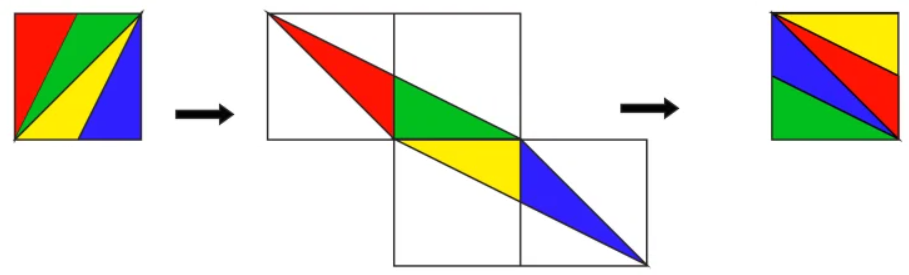
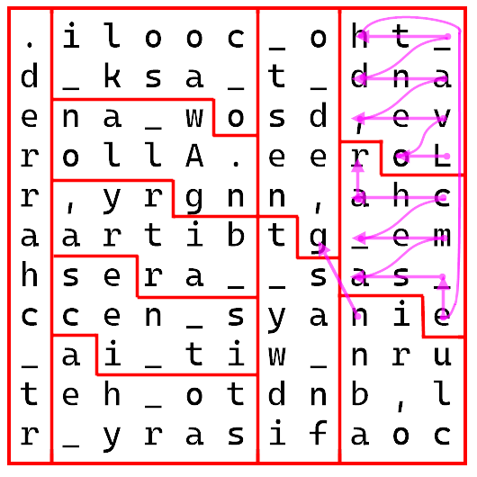
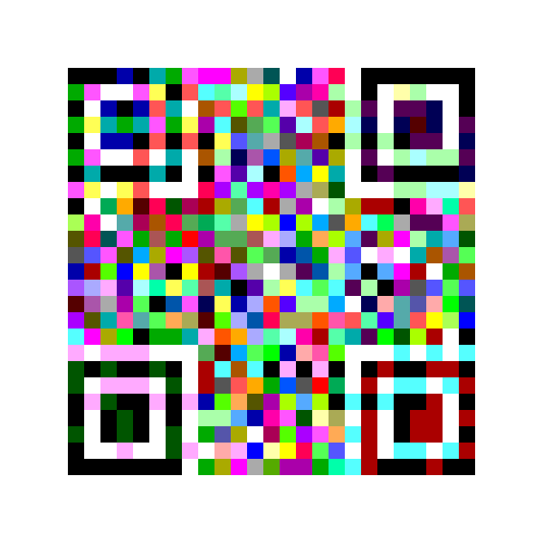
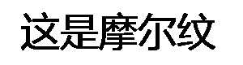
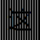
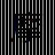
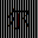
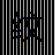
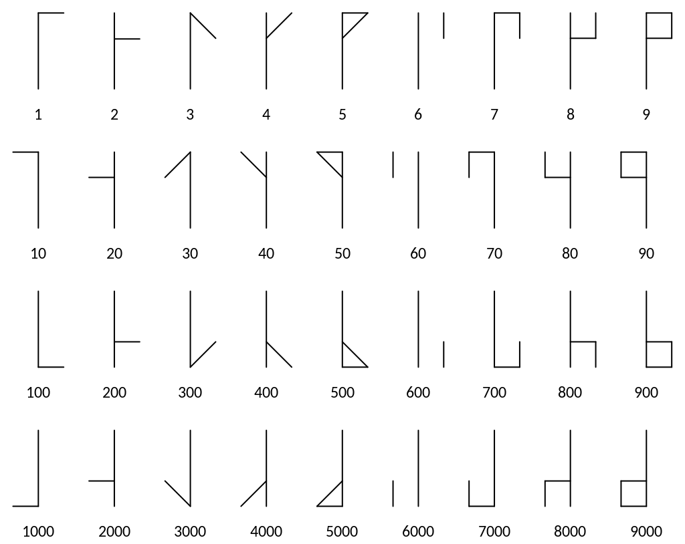
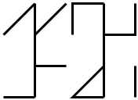

# ClassicalCryptography

This is a library that contains many classical cryptographic implementations. It is a assembly written 100% in C#. The framework version is [.Net7](https://dotnet.microsoft.com/zh-cn/download/dotnet/7.0 "dotnet7.0")。

It mainly implements the following types of classical ciphers

* [Transposition](#transposition)
* [Transposition2D](#transposition2d)
* [Replacement](#replacement)
* [Encoder](#encoder)
* [Calculation](#calculation)
* [Image](#image)
* [Sound](#sound)
* [Undefined](#undefined)

## Transposition

This type of cipher is a one-dimensional substitution cipher that only changes the order of characters without changing the content. The order is determined by a one-dimensional coordinate-based formula $f(L,x)$, where $L$ is the text length and $x$ is the coordinate index starting from 0.

This type of cipher includes the following

* [Reversecipher](#reversecipher)
* [TaketranslateCipher](#taketranslatecipher)
* [TriangleCipher](#trianglecipher)
* [JosephusCipher](#josephuscipher)
* [Railfencecipher](#railfencecipher)
* [OriginalRailFenceCipher](#originalrailfencecipher)

----------------------------------------

### ReverseCipher

ReverseCipher

* No key
* read the text from right to left
* code:

```csharp
ReverseCipher.Cipher.Encrypt("012345");
//> 543210
```

----------------------------------------

### TakeTranslateCipher

TakeTranslateCipher

* key $(n,k)$
* key irreversible
* The key is in string form of two `VChar64` characters (which means n and k will not exceed 63)
* flow chart:


* input:

|   text   |  key   |  result  |
| :------: | :----: | :------: |
| 12345678 | (2, 3) | 12675834 |

* process:

|  result  | 1 | 2 |  3  |  4  |  5  |  6  |  7  |  8  |
| -------- | - | - | :-: | :-: | :-: | :-: | :-: | :-: |
| 12       |   |   | [3] | [4] | [5] |  6  |  7  |  8  |
| 12       |   |   |  6  |  7  |  8  |  3  |  4  |  5  |
| 1267     |   |   |     |     | [8] | [3] | [4] |  5  |
| 1267     |   |   |     |     |  5  |  8  |  3  |  4  |
| 126758   |   |   |     |     |     |     |  3  |  4  |
| 12675834 |   |   |     |     |     |     |     |     |

* code:

```csharp
var key = TakeTranslateCipher.Key.FromString("23");
TakeTranslateCipher.Cipher.Encrypt("12345678", key);
//> 12675834
```

----------------------------------------

### TriangleCipher

TriangleCipher

* no key
* add length to next square number

1. The text is arranged in rows to form an (isosceles right) triangle
2. Read text by column

* input:

|   text    |  result   |
| :-------: | :-------: |
| 123456789 | 526137489 |

* diagram:

|   |   | 1 |   |   |
| - | - | - | - | - |
|   | 2 | 3 | 4 |   |
| 5 | 6 | 7 | 8 | 9 |

* code:

```csharp
TriangleCipher.Cipher.Encrypt("123456789");
//> 526137489
```

----------------------------------------

### JosephusCipher

JosephRing[^1]

* key $m$
* key irreversible
* process:

1. Imagine everyone is in a circle and starts counting
2. When the $m$th person comes out
3. Then start counting again starting with the next person
4. Repeat steps 2 and 3 until everyone comes out

* input:

|  text  | key  | result |
| :----: | :--: | :----: |
| 123456 |   3  | 364251 |

* process:

| result |  1  |  2  |  3  |  4  |  5  |  6  |
| ------ | :-: | :-: | :-: | :-: | :-: | :-: |
| 3      |  1  |  2  | [1] |  4  |  5  |  6  |
| 36     |  1  |  2  | [1] |  4  |  5  | [2] |
| 364    |  1  |  2  | [1] | [3] |  5  | [2] |
| 3642   |  1  | [4] | [1] | [3] |  5  | [2] |
| 36425  |  1  | [4] | [1] | [3] | [5] | [2] |
| 364251 | [6] | [4] | [1] | [3] | [5] | [2] |

* code:

```csharp
var key = JosephusCipher.Key.FromString("3");
JosephusCipher.Cipher.Encrypt("123456", key);
//> 364251
```

[^1]: [wikipedia/Josephus_problem](https://en.wikipedia.org/wiki/Josephus_problem)

----------------------------------------

### RailFenceCipher

RailFenceCipher

> Strictly speaking, this is not really a RailFenceCipher; It is ScytaleCipher[^25]，[OriginalRailFenceCipher](#originalrailfencecipher)is real RailFenceCipher，But this error is widespread.

* key(word per group $n$)
* process:

1. Arrange text into $n$ columns by rows
2. Read text in columns

* input

|         text        | key  |       result        |
| :-----------------: | :--: | :-----------------: |
| RailFenceCipherTest |   3  | RlnChTtaFcieeieeprs |

* diagram:

|  R  |  a  |  i  |
| :-: | :-: | :-: |
|  l  |  F  |  e  |
|  n  |  c  |  e  |
|  C  |  i  |  p  |
|  h  |  e  |  r  |
|  T  |  e  |  s  |
|  t  |     |     |

* code:

```csharp
var key = RailFenceCipher.Key.FromString("3");
RailFenceCipher.Cipher.Encrypt("RailFenceCipherTest", key);
//> RlnChTtaFcieeieeprs
```

[^25]:[wikipedia/Transposition_cipher#Scytale](https://en.wikipedia.org/wiki/Transposition_cipher#Scytale)

----------------------------------------

### OriginalRailFenceCipher

OriginalRailFenceCipher[^2]

* key(rail number $m$)
* process:

1. Write the plain text diagonally down a continuous "track" of an imaginary fence
2. Move up when you reach the bottom
3. Move down again when you reach the top
4. Repeat steps 3 and 4 until all characters are written
5. Read the text out line by line

* input

|      text       | key  |     result      |
| :-------------: | :--: | :-------------: |
| WEAREDISCOVERED |   6  | WVEOEACRRSEEIDD |

* diagram:

| W |   |   |   |   |   |   |   |   |   | V |   |   |   |   |
| - | - | - | - | - | - | - | - | - | - | - | - | - | - | - |
|   | E |   |   |   |   |   |   |   | O |   | E |   |   |   |
|   |   | A |   |   |   |   |   | C |   |   |   | R |   |   |
|   |   |   | R |   |   |   | S |   |   |   |   |   | E |   |
|   |   |   |   | E |   | I |   |   |   |   |   |   |   | D |
|   |   |   |   |   | D |   |   |   |   |   |   |   |   |   |

* code:

```csharp
//Use the same key type as the RailFenceCipher
var key = RailFenceCipher.Key.FromString("6");
OriginalRailFenceCipher.Cipher.Encrypt("WEAREDISCOVERED", key);
//> WVEOEACRRSEEIDD
```

[^2]:[wikipedia/Rail_fence_cipher](https://en.wikipedia.org/wiki/Rail_fence_cipher)

----------------------------------------

## Transposition2D

This type of cipher is a two-dimensional substitution cipher that only changes the order of characters without changing the content. The order is determined by a two-dimensional coordinate-based formula $f(L,x,y)$, where $L$ is the length of the text, $x$ is the horizontal index starting from 0, and $y$ is the vertical index starting from 0.

This type of cipher includes the following

* [CycleTranspose](#cycletranspose)
* [AdvancedRailfenceCipher](#advancedrailfencecipher)
* [RotatingGrillesCipher](#rotatinggrillescipher)
* [MagicSquareCipher](#magicsquarecipher)
* [HilbertCurveCipher](#hilbertcurvecipher)
* [SpiralCurveCipher](#spiralcurvecipher)
* [ArnoldCatMapCipher](#arnoldcatmapcipher)
* [VBakersMapCipher](#vbakersmapcipher)
* [JigsawCipher](#jigsawcipher)
* [FifteenPuzzle](#fifteenpuzzle)
* [SixteenPuzzle](#sixteenpuzzle)
* [TwiddlePuzzle](#twiddlepuzzle)

You can also specify the `TranspositionCipher2D<T>.ByColumn` property to control the direction of text composition.

----------------------------------------

### CycleTranspose

CycleTranspose

* key(permute pairs)
* Fill the rect by length to the maximum width in the permute
* process:

1. Write the text into a rectangle
2. The width is the maximum value in the permute pair
3. Swap the columns of text according to the permute pair
4. Read the text in order according to the order of the permute number

* input

|      text      |     key      |      result      |
| :------------: | :----------: | :--------------: |
| Sitdownplease! | (1,2,4)(3,5) | dSoitlwenp!a\`se |

* process:

1. Text is arranged in 5 columns

| S | i | t | d |  o  |
| - | - | - | - | :-: |
| w | n | p | l |  e  |
| a | s | e | ! |  \` |

2. Move column 1 to column 2, column 2 to column 4, column 4 to column 1

| d | S | t | i |  o  |
| - | - | - | - | :-: |
| l | w | p | n |  e  |
| ! | a | e | s |  \` |

3. Move column 3 to column 5, and column 5 to column 3

| d | S |  o  | i | t |
| - | - | :-: | - | - |
| l | w |  e  | n | p |
| ! | a |  \` | s | e |

* code:

```csharp
var key = CycleTranspose.Key.FromString("(1,2,4)(3,5)");
CycleTranspose.Cipher.Encrypt("Sitdownplease!", key);
//> dSoitlwenp!a`se
```

----------------------------------------

### AdvancedRailFenceCipher

AdvancedRailFenceCipher

> One does call it an advanced fence cipher, but it should be called ColumnarTransposition[^26]

* key(permut)
* fill the length to a rectangle whose width is the length of the permut
* process:

1. Arrange the text in rows to form a rectangle
2. The width of the rectangle is the length of the permut
3. Read the text in columns according to the order of the permut number

* input:

|        text       |      key      |          result           |
| :---------------: | :-----------: | :-----------------------: |
| eg1ML9mymEqtKzeN0 | 7,4,3,5,6,2,1 | mz\`9K\`1E0gmNMq\`Lt\`eye |

* process:

1. Text is arranged in 7 columns

| [7] | [4] | [3] | [5] | [6] | [2] | [1] |
| :-: | :-: | :-: | :-: | :-: | :-: | :-: |
|  e  |  g  |  1  |  M  |  L  |  9  |  m  |
|  y  |  m  |  E  |  q  |  t  |  K  |  z  |
|  e  |  N  |  0  |  \` |  \` |  \` |  \` |

2. Fill the list in the order of 7,4,3,5,6,2,1

| [1] | [2] | [3] | [4] | [5] | [6] | [7] |
| :-: | :-: | :-: | :-: | :-: | :-: | :-: |
|  m  |  9  |  1  |  g  |  M  |  L  |  e  |
|  z  |  K  |  E  |  m  |  q  |  t  |  y  |
|  \` |  \` |  0  |  N  |  \` |  \` |  e  |

* code:

```csharp
var key = AdvancedRailFenceCipher.Key.FromString("7,4,3,5,6,2,1");
AdvancedRailFenceCipher.Cipher.Encrypt("eg1ML9mymEqtKzeN0", key);
//> mz`9K`1E0gmNMq`Lt`eye
```

* You can also create permutations by word(By character encoding)

```csharp
var permut = PermutHelper.WordToPermutation("KEYWORD");
//> 3,2,7,6,4,5,1
var key = AdvancedRailFenceCipher.Key.FromString(permut);
AdvancedRailFenceCipher.Cipher.Encrypt("eg1ML9mymEqtKzeN0", key);
//> mz`gmNeyeLt`9K`Mq`1E0
```

[^26]:[wikipedia/Transposition_cipher#Columnar_transposition](https://en.wikipedia.org/wiki/Transposition_cipher#Columnar_transposition)

----------------------------------------

### RotatingGrillesCipher

RotatingGrillesCipher[^27]

* key(grilles position)
* Complement the length to a square with an even side length
* process:

1. Prepare a $4n^2$ rectangle
2. Dig a hole at the specified location
3. Fill in the text at the corresponding position of the grid
4. Rotate the grid (clockwise rotation by default)
5. Repeat the steps 4 times
6. Read the results by row

* The following is a valid grilles grid:
* Each grid has 4 possible positions
* So grilles represented by type`QuaterArray`
* This grilles grid is `0,0,0,0`

|  █  |  █  |     |     |
| :-: | :-: | :-: | :-: |
|  █  |  █  |     |     |
|     |     |     |     |
|     |     |     |     |

* This grilles grid is`2,3,1,0`
* string form is`4:tA==`

|     |     |  █  |     |
| :-: | :-: | :-: | :-: |
|     |  █  |     |     |
|  █  |     |     |     |
|     |     |     |  █  |

* input

|       text       |   key    |     result       |
| :--------------: | :------: | :--------------: |
| meetmeattwelvepm | `4:tA==` | tmmveeewepeatlmt |

* procrss:
* The initial situation is

|     |     |  █  |     |
| :-: | :-: | :-: | :-: |
|     |  █  |     |     |
|  █  |     |     |     |
|     |     |     |  █  |

1. Fill meet into the grid position and rotate the grid

|     |  █  |  m  |     |
| :-: | :-: | :-: | :-: |
|     |  e  |  █  |     |
|  e  |     |     |  █  |
|  █  |     |     |  t  |

2. Fill meat and rotate the grid

|  █  |  m  |  m  |     |
| :-: | :-: | :-: | :-: |
|     |  e  |  e  |  █  |
|  e  |     |  █  |  a  |
|  t  |  █  |     |  t  |

3. Fill twel and rotate the grid

|  t  |  m  |  m  |  █  |
| :-: | :-: | :-: | :-: |
|  █  |  e  |  e  |  w  |
|  e  |  █  |  e  |  a  |
|  t  |  l  |  █  |  t  |

4. Fill vepm and rotate the grid

|  t  |  m  |  m  |  v  |
| :-: | :-: | :-: | :-: |
|  e  |  e  |  e  |  w  |
|  e  |  p  |  e  |  a  |
|  t  |  l  |  m  |  t  |

* code:

```csharp
var array = new QuaterArray(4);
array[0] = 2;
array[1] = 3;
array[2] = 1;
array[3] = 0;
var key = new RotatingGrillesCipher.Key(array);
//var key = RotatingGrillesCipher.Key.FromString("4:tA==");
RotatingGrillesCipher.Cipher.Encrypt("meetmeattwelvepm", key);
//> tmmveeewepeatlmt
```

* You can also set the `AntiClockwise` property to rotate the grid anticlockwise

[^27]:[wikipedia/Grille_\(cryptography\)#Turning_grilles](https://en.wikipedia.org/wiki/Grille_\(cryptography\)#Turning_grilles)

----------------------------------------

### MagicSquareCipher

MagicSquareCipher

* no key
* Fill the length to make a square
* process:

1. Construct an n-order magic square using a specific method (magic squares can have many orders, but only the order generated by the following method is used here)
   * Odd-order magic square use Louberel(Siamese) method[^3]
   * Double even order magic square using symmetry exchange method[^4]
   * Even-order magic squares using Strachey method[^5]

2. Read the words row by row according to the order of the magic square

* Diagram of a magic square of order 3

| 8 | 1 | 6 |
| - | - | - |
| 3 | 5 | 7 |
| 4 | 9 | 2 |

* code:

```csharp
MagicSquareCipher.Cipher.Encrypt("123456789");
//> 816357492
```

[^3]:[wikipedia/Siamese_method](https://en.wikipedia.org/wiki/Siamese_method)

[^4]:[wikipedia/Magic_square#doubly_even_order](https://en.wikipedia.org/wiki/Magic_square#A_method_of_constructing_a_magic_square_of_doubly_even_order)

[^5]:[wikipedia/Strachey_method](https://en.wikipedia.org/wiki/Strachey_method_for_magic_squares)

----------------------------------------

### HilbertCurveCipher

HilbertCurveCipher

* no key
* Complement the length to a square whose side length is a power of 2
* process:

1. Construct a Hilbert curve from the upper left corner to the lower left corner
2. Fill in the characters in order according to the path
3. Read text by line

* The first 4 order Hilbert curves are shown in the figure


* 2nd order curve sequence diagram

|  1  |  4  |  5  |  6  |
| :-: | :-: | :-: | :-: |
|  2  |  3  |  8  |  7  |
| 15  | 14  |  9  | 10  |
| 16  | 13  | 12  | 11  |

* code:

```csharp
HilbertCurveCipher.Cipher.Encrypt("0123456789ABCDEF");
//> 03451276ED89FCBA
```

----------------------------------------

### SpiralCurveCipher

SpiralCurveCipher

* key (column number)
* Fill the rectangle with the length to the width of the column number
* process:

1. From top left to top right
2. From top right to bottom right
3. From bottom right to bottom left
4. From bottom left to top left
5. Arrange text in spiral order without repetition or omission

* Sequence diagram when the total number is 16 and the width is 4

|  1  |  2  |  3  |  4  |
| :-: | :-: | :-: | :-: |
| 12  | 13  | 14  |  5  |
| 11  | 16  | 15  |  6  |
| 10  |  9  |  8  |  7  |

* code:

```csharp
var key = new SpiralCurveCipher.Key(4);
SpiralCurveCipher.Cipher.Encrypt("0123456789ABCDEF", key);
//> 0123BCD4AFE59876
```

----------------------------------------

### ArnoldCatMapCipher

ArnoldCatMapCipher[^6]

* no key
* Fill the length to make a square
* process:

1. The text is arranged into a $n^2$ square matrix
2. $x=(2x+y)\mod n$
3. $y=(x+y)\mod n$
4. Encrypt the text according to the transformed sequence

* diagram:
  
* process:

| 0 | 1 | 2 | 3 |
| - | - | - | - |
| 4 | 5 | 6 | 7 |
| 8 | 9 | A | B |
| C | D | E | F |

* after map

| 0 |   |   |   |   |   |   |   |   |   |
| - | - | - | - | - | - | - | - | - | - |
|   | 4 | 1 |   |   |   |   |   |   |   |
|   |   | 8 | 5 | 2 |   |   |   |   |   |
|   |   |   | C | 9 | 6 | 3 |   |   |   |
|   |   |   |   |   | D | A | 7 |   |   |
|   |   |   |   |   |   |   | E | B |   |
|   |   |   |   |   |   |   |   |   | F |

* result

| 0 | D | A | 7 |
| - | - | - | - |
| B | 4 | 1 | E |
| 2 | F | 8 | 5 |
| 9 | 6 | 3 | C |

* code:

```csharp
ArnoldCatMapCipher.Cipher.Encrypt("0123456789ABCDEF");
//> 0DA7B41E2F85963C
```

[^6]:[wikipedia/Arnold's_cat_map](https://en.wikipedia.org/wiki/Arnold%27s_cat_map)

----------------------------------------

### VBakersMapCipher

VBakersMapCipher[^7]

* no key
* Fill the length to make a square
* The original version of the transformation formula is somewhat inconvenient, so the modified version is actually used. The specific demonstration process is as follows

* Square of even order

| 0 | 1 | 2 | 3 |
| - | - | - | - |
| 4 | 5 | 6 | 7 |
| 8 | 9 | A | B |
| C | D | E | F |

* Before folding

| 0 | 4 | 1 | 5 | 2 | 6 | 3 | 7 |
| - | - | - | - | - | - | - | - |
| 8 | C | 9 | D | A | E | B | F |

* After folding

| 0 | 4 | 1 | 5 |
| - | - | - | - |
| 8 | C | 9 | D |
| 2 | 6 | 3 | 7 |
| A | E | B | F |

* Square of odd order

| A | B | C | D | E |
| - | - | - | - | - |
| F | G | H | I | J |
| K | L | M | N | O |
| P | Q | R | S | T |
| U | W | X | Y | Z |

* Before folding

| A | F | B | G | C | H | D | I | E | J |
| - | - | - | - | - | - | - | - | - | - |
| K | P | L | Q | M | R | N | S | O | T |
| U | W | X | Y | Z |   |   |   |   |   |

* After folding

| A | F | B | G | C |
| - | - | - | - | - |
| K | P | L | Q | M |
| U | W | X | Y | Z |
| H | D | I | E | J |
| R | N | S | O | T |

* code:

```csharp
VBakersMapCipher.Cipher.Encrypt("ABCDEFGHIJKLMNOPQRSTUWXYZ");
//> AFBGCKPLQMUWXYZHDIEJRNSOT
```

[^7]:[wikipedia/Baker's_map](https://en.wikipedia.org/wiki/Baker%27s_map)

----------------------------------------

### JigsawCipher

JigsawCipher

* key(an integer partition)
* Fill the length to make a square
* process:

1. Arrange the text into a $n^2$ square matrix
2. Take a split of the integer $n$, ${p_1, p_2, ..., p_n}$
3. Divide the square matrix into $n$ blocks vertically
4. Divide each block into $p_i$ jigsaw puzzles of area $n$ in sequence
5. Right-align the remainder
6. Write the text in a **specific order**

* The following figure shows the encrypted text using `1,5,2,3`


* code

```csharp
var key = JigsawCipher.Key.FromString("1,2,1");
JigsawCipher.Cipher.Encrypt("0123456789ABCDEF", key);
//> F763E542DBA1C980
```

----------------------------------------

### FifteenPuzzle

FifteenPuzzle[^8]

* key(move steps)
* Fill the length to make a square
* process:

1. The text is arranged into a $n^2$ square matrix
2. The lower right corner is empty
3. Move the empty space and swap it with the adjacent content
4. After a series of moves, read out the square matrix

* key type is`QuaterArray`

* input

|       text       |     key     |      result      |
| :--------------: | :---------: | :--------------: |
| 0123456789ABCDEF |   `↑←←↓→`   | 012345678D9ACE_B |

* process:
* step is `↑←←↓→`

| 0 | 1 | 2 | 3 |
| - | - | - | - |
| 4 | 5 | 6 | 7 |
| 8 | 9 | A | B |
| C | D | E | _ |

| 0 | 1 | 2 | 3 |
| - | - | - | - |
| 4 | 5 | 6 | 7 |
| 8 | 9 | A | _ |
| C | D | E | B |

| 0 | 1 | 2 | 3 |
| - | - | - | - |
| 4 | 5 | 6 | 7 |
| 8 | 9 | _ | A |
| C | D | E | B |

| 0 | 1 | 2 | 3 |
| - | - | - | - |
| 4 | 5 | 6 | 7 |
| 8 | _ | 9 | A |
| C | D | E | B |

| 0 | 1 | 2 | 3 |
| - | - | - | - |
| 4 | 5 | 6 | 7 |
| 8 | D | 9 | A |
| C | _ | E | B |

| 0 | 1 | 2 | 3 |
| - | - | - | - |
| 4 | 5 | 6 | 7 |
| 8 | D | 9 | A |
| C | E | _ | B |

* code:

```csharp
var array = new QuaterArray(5);
array[0] = 1;
array[1] = 2;
array[2] = 2;
array[3] = 3;
array[4] = 0;
var key = new FifteenPuzzle.Key(array);
//var key = FifteenPuzzle.Key.FromString("5:awA=");
//var key = FifteenPuzzle.Key.FromString("↑←←↓→");
FifteenPuzzle.Cipher.Encrypt("0123456789ABCDE_", key);
//> 012345678D9ACE_B
```

[^8]:[wikipedia/15_puzzle](https://en.wikipedia.org/wiki/15_puzzle)

----------------------------------------

### SixteenPuzzle

SixteenPuzzle

* key(move steps)
* Fill the length to make a square
* process:

1. Arrange the text into a $n^2$ square matrix
2. Move the entire row/column in a circular motion
3. Read the square matrix after a series of moves

* The key is represented by positive and negative numbers representing rows and columns respectively, and the movement direction is right and down
* input:

|       text       |      key      |     result       |
| :--------------: | :-----------: | :--------------: |
| 0123456789ABCDEF | `2,-3,1,4,-1` | F01E3426795B8CDA |

* process:

1. The initial situation is

| 0 | 1 | 2 | 3 |
| - | - | - | - |
| 4 | 5 | 6 | 7 |
| 8 | 9 | A | B |
| C | D | E | F |

2. Move row 2

| 0 | 1 | 2 | 3 |
| - | - | - | - |
| 7 | 4 | 5 | 6 |
| 8 | 9 | A | B |
| C | D | E | F |

3. Move column 3

| 0 | 1 | E | 3 |
| - | - | - | - |
| 7 | 4 | 2 | 6 |
| 8 | 9 | 5 | B |
| C | D | A | F |

4. Move rows 1 and 4

| 3 | 0 | 1 | E |
| - | - | - | - |
| 7 | 4 | 2 | 6 |
| 8 | 9 | 5 | B |
| F | C | D | A |

5. Move Column 1

| F | 0 | 1 | E |
| - | - | - | - |
| 3 | 4 | 2 | 6 |
| 7 | 9 | 5 | B |
| 8 | C | D | A |

* code:

```csharp
var key = SixteenPuzzle.Key.FromString("2,-3,1,4,-1");
SixteenPuzzle.Cipher.Encrypt("0123456789ABCDEF", key);
//> F01E3426795B8CDA
```

----------------------------------------

### TwiddlePuzzle

TwiddlePuzzle

* key(twiddle position array)
* Fill the length to make a square
* process:

1. Arrange the text into a $n^2$ square matrix
2. Rotate clockwise around the specified 4 grids
3. Read the square matrix after a series of rotations

* The number of the key represents the rotation position

* input:

|       text       |    key    |      result      |
| :--------------: | :-------: | :--------------: |
| 0123456789ABCDEF | `1,2,3,5` | 412059638A7BCDEF |

* process:
* The initial situation is

| [0] | [1] |  2  |  3  |
| :-: | :-: | :-: | :-: |
| [4] | [5] |  6  |  7  |
|  8  |  9  |  A  |  B  |
|  C  |  D  |  E  |  F  |

1. Move the 1st position

|  4  | [0] | [2] |  3  |
| :-: | :-: | :-: | :-: |
|  5  | [1] | [6] |  7  |
|  8  |  9  |  A  |  B  |
|  C  |  D  |  E  |  F  |

2. Move the 2nd position

|  4  |  1  | [0] | [3] |
| :-: | :-: | :-: | :-: |
|  5  |  6  | [2] | [7] |
|  8  |  9  |  A  |  B  |
|  C  |  D  |  E  |  F  |

3. Move the 3rd position

|  4  |  1  |  2  |  0  |
|  -  |  -  |  -  |  -  |
|  5  | [6] | [7] |  3  |
|  8  | [9] | [A] |  B  |
|  C  |  D  |  E  |  F  |

5. Move the 5th position

|  4  |  1  |  2  |  0  |
|  -  |  -  |  -  |  -  |
|  5  |  9  |  6  |  3  |
|  8  |  A  |  7  |  B  |
|  C  |  D  |  E  |  F  |

* code:

```csharp
var key = TwiddlePuzzle.Key.FromString("1,2,3,5");
TwiddlePuzzle.Cipher.Encrypt("0123456789ABCDEF", key);
//> 412059638A7BCDEF
```

----------------------------------------

## Replacement

This type of cipher encrypts the text by replacing symbols in the plain text with other symbols.

This type of cipher includes the following

* [SingleReplacementCipher](#singlereplacementcipher)
* [MorseCode](#morsecode)
* [CommercialCode](#commercialcode)
* ~~[EnigmaMachine](#enigmamachine)~~
* [Encoder](#encoder)
* [PLEncoding](#plencoding)

----------------------------------------

### SingleReplacementCipher

Monoalphabetic substitution ciphers, which map characters in the plaintext to another set of characters, include the following

* `AffineCipher`

   ```csharp
   var cipher = new AffineCipher(5, 8);
   cipher.Encrypt("abcdefghijklmnopqrstuvwxyz");
   //> insxchmrwbglqvafkpuzejotyd
   ```

* CeaserCipher`

   ```csharp
   var cipher = new CeaserCipher(3);
   cipher.Encrypt("hello");
   //> khoor
   ```

> The following are members of `CommonTables`

* QWERKeyboard
* Atbash
* ChinesePinyin
* rot5
* rot13
* rot18(rot5+rot13)
* rot47
* Al Bhed(include japanese hiragana)
* Dvorak
* DvorakLeftHand
* DvorakRightHand
* Colemak
* LIIGOLLayout
* AZERTY
* Asset
* Carpalx
* Minimak4Keys
* Minimak8Keys
* Minimak12Keys
* Norman
* Workman
* MTOHOEM
* Saurian
* PartTimerDevil
* IChingEightTrigramsBase64
* 火星文
* TapCode
* ADFGX

* more...

----------------------------------------

### MorseCode

A code that uses signal duration and discontinuity to indicate content, including the following categories

* English letters + numbers + code(`English`)
* Digital short code(`ShortDigit`)
* Chinese Zhuyin code(`ChineseZhuyin`)

----------------------------------------

### CommercialCode

* Chinese Commercial Code[^9]
* use Digital short code
* code:

```csharp
CommercialCode.ToCodesString("中文");
//> 00222429
CommercialCode.ToMorse("中文");
//> .-/.-/...--/...--/...--/...../...--/-
CommercialCode.FromCodeString("71934316");
//> 电码
CommercialCode.FromMorse("-../..-/-/....-/...../....-/..-/--...");
//> 电码
```

[^9]:[Chinese Commercial Code](https://www.chasedream.com/show.aspx?id=4487&cid=30)

----------------------------------------

### EnigmaMachine

EnigmaMachine

* *This feature is not yet complete*

----------------------------------------

## Encoder

Conversion between computer codes supports the following

> The following are some methods in `BaseEncoding`

* Base64
* Base64URL
* Base100[^10]
* Base2048[^11]
* Base65536[^12]
* Base32768[^13]
* Base32[^14]
* Base58(Bitcoin address encoding)
* Base85[^15]
* Base16(Hex)
* Base(Encode using any table)
* 2,4,8(`BinaryEncoding`)
* Braille code[^16]
* Roman Numerals(`RomanNumerals`)
* Pinyin NineKey(`PinyinNineKey`)

  * Default

  ```csharp
  PinyinNineKey.Default.LettersToCodes("HELLO");
  //> 4232535363
  PinyinNineKey.Default.ToCodes("拼音");
  //> 714362934362
  PinyinNineKey.Default.FromCodes("4232535363714362934362");
  //> HELLOPINYIN
  ```

* `BubbleBabble`[^17]
* `ChineseCommonBraille`[^18]
  * The choice of polyphones may not be correct, but you can specify the pinyin yourself
  * The following options are provided by `ChineseCommonBraille.Settings`
    * `AutoSimplify`:Indicates that traditional Chinese characters are converted to simplified Chinese characters when encoding
    * `EncodeTonenote`:Indicates that tones should be encoded (soft tone 5 will be ignored)
    * `EncodePunctuation`:Indicates that punctuation marks should be encoded as follows
    `。，、；？！：“”‘’（）【】—…《》〈〉`
    * `EncodeNumber`:Indicates that a number should be encoded
    * `EncodeLetters`:Indicates that English letters should be encoded
    * `DistinguishThird`:Instructions should distinguish between “他她它”
    * `UseAbbreviations`:Abbreviation rules for indicating partial tones
  * code:

  ```csharp
  ChineseCommonBraille.OutputPinyin.Encode("盲文编码说", out string? py);
  //> ⠍⠦⠒⠂⠃⠩⠁⠍⠔⠄⠱⠺
  //py> 盲(MANG2)文(WEN2)编(BIAN1)码(MA3)说(SHUI4)
  ChineseCommonBraille.OutputPinyin.Encode("盲文编码说(shuo1)", out py);
  //> ⠍⠦⠒⠂⠃⠩⠁⠍⠔⠄⠱⠕⠁
  //py> 盲(MANG2)文(WEN2)编(BIAN1)码(MA3)说(SHUO1)
  ```

  * decode:

  ```csharp
  var bt = ChineseCommonBraille.Decodeable.Encode("谁水双举盲文编码就说(shuo1)指纹很准噶");
  var py = ChineseCommonBraille.Decodeable.DecodePinyins(bt);
  ChineseCommonBraille.Decodeable.ResolvePinyins(py);
  //bt> ⠱⠮⠂⠱⠺⠄⠱⠶⠁⠛⠥⠄⠍⠦⠂⠒⠂⠃⠩⠁⠍⠔⠄⠛⠳⠆⠱⠕⠁⠌⠄⠒⠂⠓⠴⠄⠌⠒⠄⠛⠔⠂
  //py> SH(I)EI2SH(I)[UI/WEI]3SH(I)[UANG/WANG]1[G/J][U/WU]3MANG2[UN/WEN]2B[IAN/YAN]1MA3[G/J][IU/YOU]4SH(I)[UO/WO]1ZH(I)3[UN/WEN]2[H/X]EN3ZH(I)[UN/WEN]3[G/J]A2
  //> SHEI2SHUI3SHUANG1[G/J]U3MANG2WEN2BIAN1MA3JIU4SHUO1ZHI3WEN2HEN3ZHUN3GA2
  ```

* `FourCornerCode`[^19]
* `ChinesePinyin`[^30]

    ```csharp
    var pinyins = ChineseHelper.GetPinyinFromText("就是这样");
    string.Join(',', pinyins.Select(py => py.ToZhuyin()));
    //> ㄐㄧㄡ,ㄕ,ㄓㄜ,ㄧㄤ
    ```

  * You can also use `ChinesePinyin.FromZhuyin` to convert Zhuyin back to Pinyin

* QuotedPrintable[^20]
* `UnicodeEncoding`
* UrlEncode(`WebEncoding`)
* HtmlEncode(`WebEncoding`)
* IPv6 address encoding(`WebEncoding`)
* Base85ipv6 address encoding(`WebEncoding`)
* PGP Word List(`PGPWordList`)[^29]

[^10]:[base100](https://github.com/AdamNiederer/base100)
[^11]:[base2048](https://github.com/qntm/base2048)
[^12]:[base65536](https://github.com/qntm/base65536)
[^13]:[base32768](https://github.com/qntm/base32768)
[^14]:[wikipedia/Base32](https://en.wikipedia.org/wiki/Base32)
[^15]:[wikipedia/Base85](https://en.wikipedia.org/wiki/Ascii85)
[^16]:[braille-encode](https://github.com/qntm/braille-encode)
[^17]:[Bubble_Babble](http://bohwaz.net/archives/web/Bubble_Babble.html)
[^18]:[国家通用盲文方案](http://www.moe.gov.cn/jyb_sjzl/ziliao/A19/201807/W020180725666187054299.pdf)
[^19]:[wikipedia/四角号码](https://zh.wikipedia.org/zh-cn/%E5%9B%9B%E8%A7%92%E5%8F%B7%E7%A0%81)
[^20]:[wikipedia/Quoted-printable](https://en.wikipedia.org/wiki/Quoted-printable)
[^29]:[Whole-Word Phonetic Distances and the PGPfone Alphabet](http://www.asel.udel.edu/icslp/cdrom/vol1/005/a005.pdf)
[^30]:[wikipedia/注音符號](https://zh.wikipedia.org/wiki/%E6%B3%A8%E9%9F%B3%E7%AC%A6%E8%99%9F)

----------------------------------------

### PLEncoding

Strongly related to programming languages, the following are supported

* Bytes strings in Python
* Punycode[^21]
* PPEncode[^22]
* AAEncode(js code that can be run directly in the browser)
* JJEncode(js code that can be run directly in the browser)
* Jother(js code that can be run directly in the browser)
* Brainfuck[^23]\(In fact, it also supports several extended instructions\)

[^21]:[wikipedia/Punycode](https://en.wikipedia.org/wiki/Punycode)
[^22]:[esolangs/Ppencode](https://esolangs.org/wiki/Ppencode)
[^23]:[wikipedia/Brainfuck](https://en.wikipedia.org/wiki/Brainfuck)

----------------------------------------

## Calculation

Passwords calculated using a special custom algorithm implement the following

* [ShortHide5](#shorthide5)
* [RSASteganograph](#rsasteganograph)
* [PerfectShuffle](#perfectshuffle)

----------------------------------------

### ShortHide5

* It's too complicated to explain, you can just look at the code implementation

----------------------------------------

### RSASteganograph

RSASteganograph

* Generates a prime number with the specified prefix bytes and calculates the RSA private key
* The generated private key can be used like a normal private key
* You can specify to generate a key in XML or PEM format
* code:

```csharp
var text = "天空不会一直都晴朗的，偶尔会下些雨滴，也有吹起暴风雨的时候，景色会渐渐的改变。";
var pemkey = RSASteganograph.GenerateRSAPrivateKey(text, true);
//A RSA private key in pem format will be generated
RSASteganograph.GetTextFrom(pemkey);//Get the text
```

----------------------------------------

### PerfectShuffle

PerfectShuffle[^28]

* Perform 2 alternating perfect shuffles on the alphabet
* Take the specified first letter as the result

[^28]:[erikdemaine/shuffle](http://erikdemaine.org/fonts/shuffle/)

----------------------------------------

## Image

The encryption result is the password of the image, including the following

* [PigpenCipher](#pigpencipher)
* [ColorfulBarcode](#colorfulbarcode)
* [MoirePattern](#moirepattern)
* [WeaveCipher](#weavecipher)
* [CisterciansNumerals](#CisterciansNumerals)
* [Steganography](#steganography)
* [NotMosaic](#notmosaic)
* [PhantomTank](#phantomtank)
* [Stereogram](#stereogram)
* ~~[StringArtCipher](#stringartcipher)~~

### PigpenCipher

PigpenCipher

* no key
* Only handles plain English text
* Standard version alphabet

* Alphabet of variant versions


----------------------------------------

### ColorfulBarcode

ColorfulBarcode

* no key

1. The text is divided into 3 parts/6 parts
2. Generate 3/6 QR codes
3. The QR codes correspond to the RGB color channels (3 copies)
4. Please refer to the specific implementation for 6 groups of colors

* An example of a 3-color QR code

* `3oX+o67864CwiRYVndetxFyZuy7T59Rv0gc9eUSKwU/kWbNy1PGbtfJrrE/s9Can0N5sbPyOcXedYvwEom6qmQqMlfLCwkpZrp3j`


* The 6-color QR code with the same content is



```csharp
var plainText = "你想编码的内容";
var bitmap = ColorfulBarcode.Encode(plainText);//Generate 3-color QR code
var text = ColorfulBarcode.Recognize(bitmap);//Recognize 3-color QR code
bitmap = ColorfulBarcode.EncodeSixColor(plainText);//Generate 6-color QR code
text = ColorfulBarcode.RecognizeSixColor(bitmap);//Recognize 6-color QR code
```

----------------------------------------

### MoirePattern

MoirePattern

* Supports non-embedded and embedded
* Support custom stripe styles
* Supports static content and multi-frame content
* Static non-embedded example

```csharp
MoirePattern.Font = new Font("微软雅黑", 36);
var bitmap = MoirePattern.DrawText("这是摩尔纹", 300, 80, MoirePatternTypes.DiagonalPatten);
bitmap.Save("E:/MoirePattern.png");
```


```csharp
MoirePattern.FillPatten(bitmap, MoirePatternTypes.DiagonalPatten);
```


```csharp
MoirePattern.FillPatten(bitmap, MoirePatternTypes.DiagonalPatten, removePatten: true);//remove patten
```



* Embedded example, replacing the waveform stripes

```csharp
MoirePattern.Font = new Font("微软雅黑", 36);
var bitmap = MoirePattern.DrawText("这是摩尔纹", 300, 80, MoirePatternTypes.SinWavePatten, true);
bitmap.Save("E:/MoirePatternEmbedded.png");
```


* Considering the embedded presentation effect, only the stripe removal effect is selected


* Example of moiré patterns across multiple frames

```csharp
MoirePattern.Font = new Font("微软雅黑", 36);
var bitmap = MoirePattern.DrawTexts(new[] { "这", "是", "摩", "尔", "纹" }, 80, 80);
bitmap.Save("E:/Pattens.png");
MoirePattern.FillAndSavePattens(bitmap, 5, "E:/Pattens");
```

  


----------------------------------------

### WeaveCipher

WeaveCipher

* Square example

```csharp
var bitmap = WeaveCipher.Encrypt("GOOD");
bitmap.Save("E:/WeaveCipher.png");
WeaveCipher.Decrypt(bitmap);
//> GOOD
```


* Example with triangle

```csharp
var bitmap = WeaveCipher.EncryptExtend("GOOD Night");
bitmap.Save("E:/WeaveCipherExtend.png");
```


----------------------------------------

### CisterciansNumerals[^24]

Cistercians numbers, a 10000-base number system represented by specific symbols



* code:

```csharp
var bitmap = CisterciansNumerals.Encode(12345678);
bitmap.Save("E:/12345678.png");
```



[^24]:[wikipedia/Cistercian_numerals](https://en.wikipedia.org/wiki/Cistercian_numerals)

----------------------------------------

### Steganography

Image steganography, writing information in the LSB (least significant bit) of the image pixel color value

* Standalone programs (not included in this library)
* Winforms application(net6.0-windows)
* [存储库地址](https://github.com/Lazuplis-Mei/Steganography)

### NotMosaic

Encrypt the specified area of ​​the image

* Encrypt the specified rectangular area
* Support password encryption
* Use masks to adjust the effect

* pictures:


* code:

```csharp
var bitmap = new Bitmap("E:/NotMosaicSample.png");
var rects = new Rectangle[]
{
    new Rectangle(100, 50, 100, 200),
};
bitmap = NotMosaic.Encrypt(bitmap, rects, out EncryptRegions encryptRegions, "123456");
bitmap.Save("E:/NotMosaicEncrypted.png");
```


```csharp
NotMosaic.Decrypt(bitmap, encryptRegions, "123456").Save("E:/NotMosaicDecrypted.png");
```


----------------------------------------

### PhantomTank

Phantom Tank uses color matching and blending to make the image show different content against a black and white background.

* Support color images

* images:


* code:

```csharp
PhantomTank.Combine(new Bitmap("E:/Foreground.png"), new Bitmap("E:/Background.png")).Save("E:/PhantomTank.png");
```


* Color picture demo:

```csharp
PhantomTank.CombineColorful(new Bitmap("E:/Foreground.png"), new Bitmap("E:/Background.png")).Save("E:/ColorfulPhantomTank.png");
```


----------------------------------------

### Stereogram

Naked eye 3D image

* Using depth maps and textures to create naked-eye 3D images
* Setting the fuzzy parameters
* Support depth specification
* Parallel eyes vs. crossed/crossed eyes
* Demo Depth Map


* Demo Texture


* code:

```csharp
Stereogram.MakeWithPattern(new Bitmap("E:/shark.png"), new Bitmap("E:/jellybeans2.jpg")).Save("E:/stereogram.png");
```


* You can find [more textures](https://github.com/mexomagno/stereogramaxo/tree/master/patterns) here

----------------------------------------

### StringArtCipher

StringArtCipher

* *This feature is not yet complete*

----------------------------------------

## Sound

The encrypted result is sound

### MorseMoonlight

MorseMoonlight

* Incorporating Morse code into the rhythm of the first movement of the Moonlight Sonata
* If you want to be able to encode to Wav, you need to provide a soundfont file, edited in TIMIDITY.CFG

```csharp
var morseCode = MorseCode.Standred.ToMorse("MorseMoonlight");
MorseMoonlight.ExportMidi(morseCode, "E:/MorseMoonlight.mid");
MorseMoonlight.ExportWav(morseCode, "E:/MorseMoonlight.wav");
```

[MorseMoonlight.mid](https://github.com/Lazuplis-Mei/ClassicalCryptography/blob/main/Sound/MorseMoonlight.mid)

* Note: The length of the rhythm that can be encoded is limited

----------------------------------------

## Undefined

Undefined

### SemaphorePathCipher

SemaphorePathCipher

* no key
* 

1. Start from the upper left corner from left to right
2. Connect a letter according to the symbol corresponding to the flag
3. Delete all letters on the path
4. The rest is the content

----------------------------------------

### StringArtCipher

StringArtCipher

* Euler font using 22 pins
* Non-Eulerian font using 22 pins

----------------------------------------

### PascalianPuzzleCipher

PascalianPuzzleCipher

* Perform a specific transformation on the data
